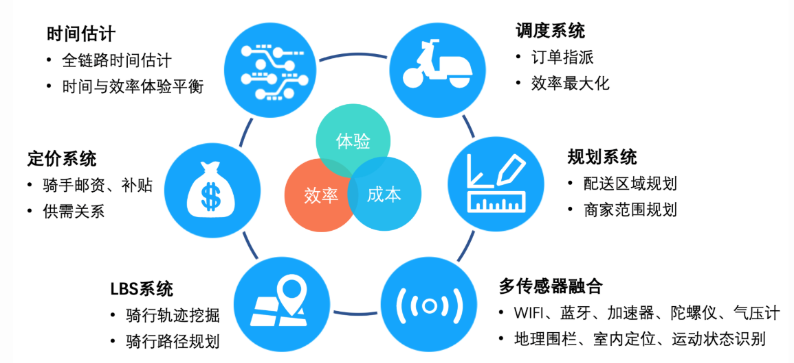
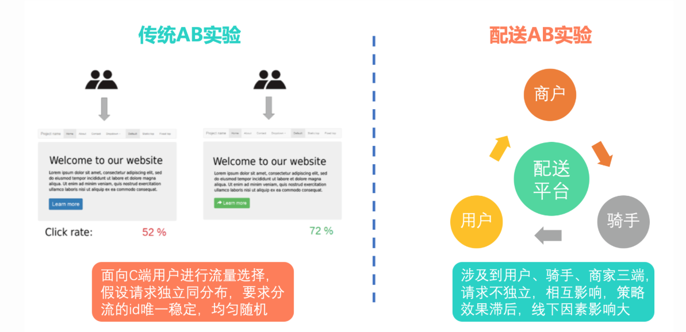
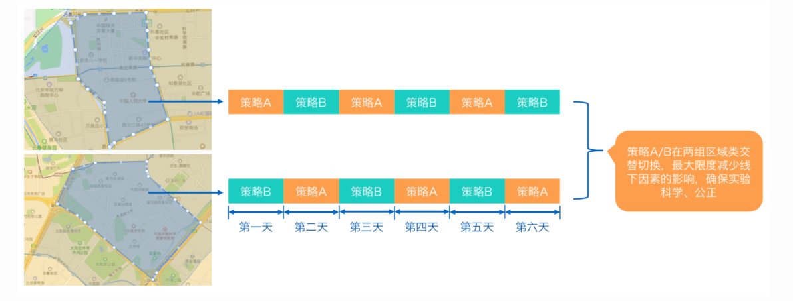

# 美团-机器学习资料搜集

> 资料整理自：[美团技术团队](https://tech.meituan.com/tags/%E6%9C%BA%E5%99%A8%E5%AD%A6%E4%B9%A0.html)

## 1. 业务要求

具体到机器学习方向而言，挑战包括以下几个方面：

- 精度足够高、粒度足够细

    - 时间要求：一方面是周期性变化，比如早午晚，工作假日，季节变化；一  方面- 是分钟级的精细度，比如一个商圈单量和运力的实时变化。
    - 空间要求：一方面是不同商圈独有特性，比如CBD区域；一方面是要实现楼 栋- 和楼层的精度，比如1楼和20楼，就是完全不同的配送难度。
    - 鲁棒性要求：处理各种不确定的能力，比如天气变化、交通变化等等。

- 线下数据质量的巨大挑战
    
    - 大噪音：比如GPS定位漂移，尤其是在高楼附近，更不要说在室内GPS基本  不- 可用。
    - 不完备：比如商家后厨数据、堂食数据、其他平台数据，都极难获得。
    - 高复杂：配送场景多样而且不稳定，随着时间、天气、路况等在不断变化。

## 2. 美团特殊ABtest模式

- **什么是AB test？**
 AB实验在产品优化中的应用方法是：在产品正式迭代发版之前，为同一个目标制定两个（或以上）方案，将用户流量对应分成几组，在保证每组用户特征相同的前提下，让用户分别看到不同的方案设计，根据几组用户的真实数据反馈，科学的帮助产品进行决策。

- **美团特殊情况**
即时配送领域的AB实验是围绕用户、商户、骑手三者进行，用户/商户/骑手之间不再是相互独立的，而是相互影响相互制约的。

- **定制方案**
分时间片AB对照
