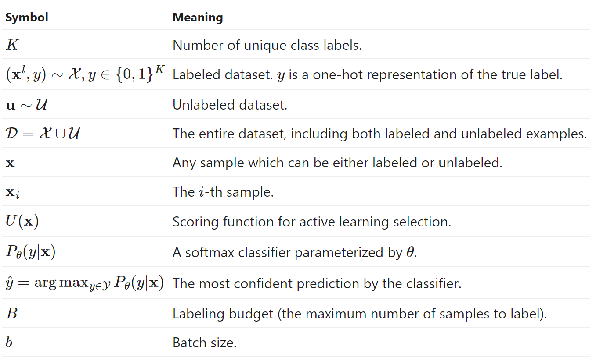
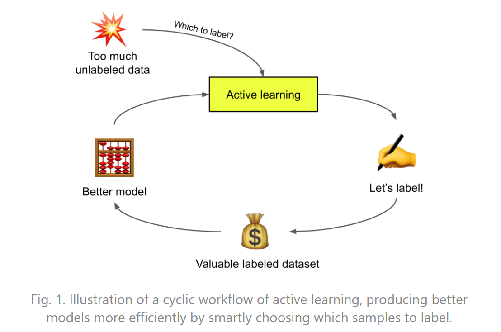
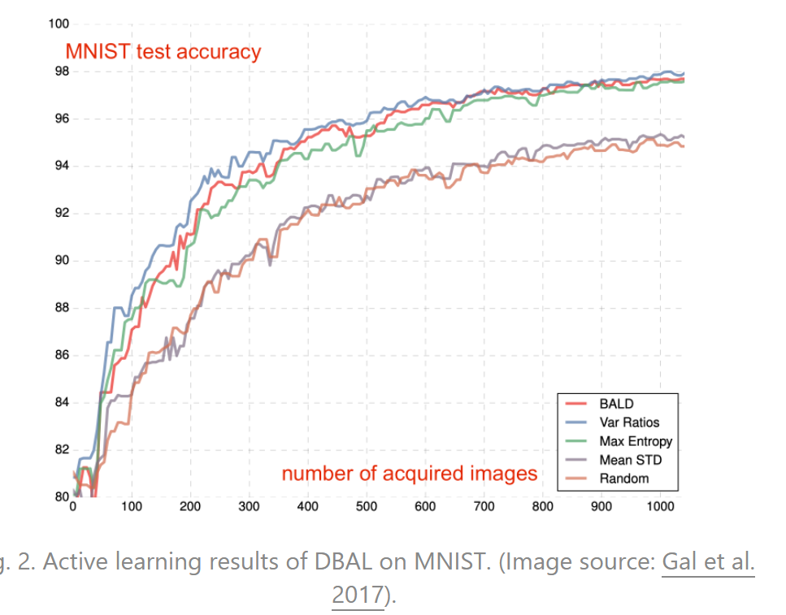

# Active Learning 1/2

> 对[Learning with not Enough Data Part 2: Active Learning](https://lilianweng.github.io/posts/2022-02-20-active-learning/) 翻译、提炼的笔记。
>
> 
>
> @article{weng2022active,
>   title   = "Learning with not Enough Data Part 1: Semi-Supervised Learning",
>   author  = "Weng, Lilian",
>   journal = "lilianweng.github.io",
>   year    = "2022",
>   url     = "https://lilianweng.github.io/posts/2022-02-20-active-learning/"
> }

## 0. Notations

## 1. 什么是Active Learning 主动学习？

给定一个未标注的数据集$\mathcal{U}$，以及固定数量的标签成本$B$，active learning 旨在从 $\mathcal{U}$中选择一个大小为$B$的子集进行标注，以使这些新标注的样本可以**最大限度地提高模型性能**。在医学影像等数据标注困难且成本高昂时，主动学习尤其适用。

本文主要介绍主动学习在深度神经网络模型下的使用。

为简化讨论，我们假定任务是 $K$-类别的分类任务，模型参数为$\theta$，模型输出概率分布有$P_\theta(y|\mathbf{x})$，预测为$\hat{y}=\arg \max _{y \in \mathcal{Y}} P_{\theta}(y \mid \mathbf{x})$。

## 2. Acquisition Function

识别最有价值的样本以便对其打标签的过程称为 “**sampling strategy** 采样策略” 或 “**query strategy** 查询策略”。采样过程中的评分函数称为 “**Acquisition function** 采集函数”，记为$U(x)$。评分越高的样本，意味着他们被打标签后可能为模型提供更大的提升。

下述一些基本的采样策略：

### 2.1 Uncertainty Sampling

**Uncertainty Sampling** 选择模型产生最多不确定性预测的样本。给。定一个模型，不确定性可以通过**预测概率**来估计。

- *Least confident score*, 也称 *variation ratio*: $U(\mathbf{x})=1-P_{\theta}(\hat{y} \mid \mathbf{x})$；
- *Margin score*: $U(\mathbf{x})=P_{\theta}\left(\hat{y}_{1} \mid \mathbf{x}\right)-P_{\theta}\left(\hat{y}_{2} \mid \mathbf{x}\right)$, 其中 $\hat{y}_{1}$、 ${y}_{2}$是最有可能和第二可能的预测标签；
- *Entropy*: $U(\mathbf{x})=\mathcal{H}\left(P_{\theta}(y \mid \mathbf{x})\right)=-\sum_{y \in \mathcal{Y}} P_{\theta}(y \mid \mathbf{x}) \log P_{\theta}(y \mid \mathbf{x})$

量化不确定性的另一种方法是依靠"专家模型委员会"(Query-By-Committee (QBC)，QBC 根据一组"意见"来衡量不确定性，因此在委员会成员之间保持一定程度的"分歧"至关重要。若给定$C$个模型作为专家委员会，每个模型参数为 $\theta_1,...,\theta_2$，有：

- *Voter entropy*: $U(\mathbf{x})=\mathcal{H}\left(\frac{V(y)}{C}\right)$, $V(y)$标签 y 的投票数。
- *Consensus entropy*: $U(\mathbf{x})=\mathcal{H}\left(P_{\mathcal{C}}\right)$, $P_{\mathcal{C}}$为预测的均值。
- *KL divergence*: $U(\mathbf{x})=\frac{1}{C} \sum_{c=1}^{C} D_{\mathrm{KL}}\left(P_{\theta_{c}} \mid P_{\mathcal{C}}\right)$。

### 2.2 Diversity Sampling

**Diversity sampling** 希望找出能较好代表整个**数据集分布**的样本集合。高多样性能让模型表现不局限于某一样本集。Diversity Sampling 选出的样本应能代表基本分布。常见的方法通常依赖于量化样本之间的相似性。

### 2.3 Expected Model Change

**Expected Model Change**是指样本对模型训练带来的影响。影响可以是对模型权重的影响或对训练损失的改进。

### 2.4 Hybrid Strategy

上述方法并不互斥。混合采样策略重视样本的不同属性，将不同的采样偏好组合为一个。通常我们希望选择**不确定且具有高度代表性(uncertain but also highly representative)**的样本。

## 3. Deep Acquisition Function

### 3.1 Measuring Uncertainty

通常分为两类 ([Der Kiureghian & Ditlevsen 2009](https://citeseerx.ist.psu.edu/viewdoc/download?doi=10.1.1.455.9057&rep=rep1&type=pdf), [Kendall & Gal 2017](https://arxiv.org/abs/1703.04977)):

- *Aleatoric uncertainty* 由数据中的噪声（例如传感器数据、测量过程中的噪声）引入，它可以与输入相关或与输入无关。一般来说我们认为这部分不确定性无法减少。
- *Epistemic uncertainty* 是指模型参数内的不确定性，我们不知道模型是否能最好地解释数据。理论上来说，给定更多数据，这种不确定性可减少。

### 3.2 Ensemble and Approximated Ensemble

集成学习在传统机器学习中取得不小的成功，为了获得更好的不确定性估计我们很直观地想尝试聚合一组独立训练的模型。然而，训练单个深度神经网络的成本很高，别说炼好多炉了。

在主动学习中，常用dropout来"模拟"概率高斯过程 probabilistic Gaussian process ([Gal & Ghahramani 2016](https://arxiv.org/abs/1506.02142))。因此，我们从**同一**模型中收集在前向传播时不同 dropout比的**多个**样本来做集成，从而估计模型的不确定性（epistemic uncertainty）。该过程被命名为**MC dropout** (Monte Carlo dropout)，其中 dropout 在每个权重层前应用，已证明在数学上等同于概率深度高斯过程的近似值 ([Gal & Ghahramani 2016](https://arxiv.org/abs/1506.02157))。这个简单的想法已被证明对小数据集的分类是有效的，并且在需要有效的模型不确定性估计的场景中被广泛采用。

**DBAL** (Deep Bayesian active learning; [Gal et al. 2017](https://arxiv.org/abs/1703.02910))  用 MC dropout 逼近贝叶斯神经网络，从而学习模型权重的分布。在他们的实验中，MC dropout 的表现优于随机基线和平均标准差 (Mean STD)，类似于variation ratios和entropy measurement。

[Beluch et al. (2018)](https://openaccess.thecvf.com/content_cvpr_2018/papers/Beluch_The_Power_of_CVPR_2018_paper.pdf) 将集成模型与 MC dropout 进行了比较，发现naive集成（即分别独立地训练多个模型）和variation ratio的组合产生了比其他模型更好的预测。然而，naive集成开销高昂，所以他们探索了一些更便宜的选择：

- Snapshot ensemble: 使用循环学习率来训练一组隐式的集成模型，使其收敛到不同的局部最小值。
- Diversity encouraging ensemble (DEE): 使用经过少量 epoch 训练的基础网络来初始化n 个不同网络，每个网络都经过 dropout 训练以鼓励多样性。
- Split head approach: 一个基础模型有多个头，每个头对应一个分类器。

遗憾的是，上述开销相对低的隐式集成模型的性能都比naive集成差。考虑到计算资源的限制，MC dropout 仍然是一个不错且经济的选择。自然地，人们也尝试将 ensemble 和 MC dropout 结合起来 ([Pop & Fulop 2018](https://arxiv.org/abs/1811.03897))，以通过随机 ensemble 获得一些额外的性能增益。

