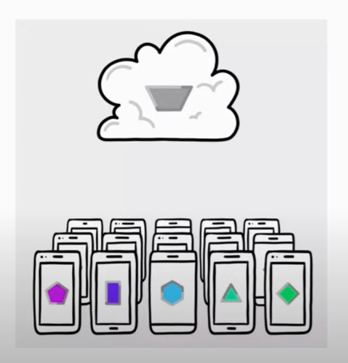
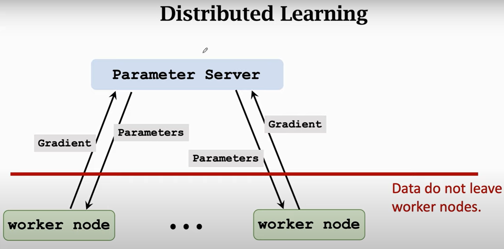
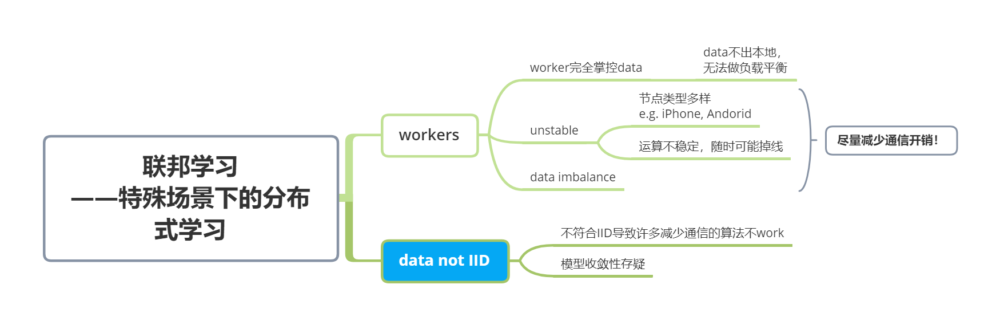

# 联邦学习01——技术层面的联邦入门

> 本篇联邦学习 Federated Learning笔记 总结自课程：[https://www.youtube.com/watch?v=STxtRucv_zo](https://www.youtube.com/watch?v=STxtRucv_zo)

# 1. motivation简述

以Google为例，Google有许多app运行在各种各样的的手机上。

- 目标：希望使用**用户数据**训练模型；
- 最直接的方案：收集用户数据至服务器，使用集群完成模型训练；
- 问题：需要保护**用户数据隐私**！用户不愿提供个人数据。

总结：

在许多场景中，人们希望在**数据不出本地，保护隐私**的情况下，利用**多方数据**训练更好的模型。

为达成上述目标，人们提出了**联邦学习Federated Learning**的概念

# 2. 概念辨析

联邦学习，本质上是**特殊需求下的分布式学习**。

我们回顾分布式学习的基本场景：

- worker节点：负责接收server传来的更新后的参数，冰计算本地数据的gradient，发送gradient给server；
- server节点：负责接收gradients，计算global gradient后更新参数并发还。

上述范式中，我们看到workers就如多方数据源，在分布式学习的场景下，数据没有离开worker，吻合联邦学习的初衷。

实际上，联邦学习就是在具体挑战下的分布式学习，其所面临场景有如下特征：

# 3. 研究方向

联邦学习的特殊场景带来了新的挑战，其主要研究方向如下：

1. communication-efficiency

   如上图，可见通信开销是模型训练的主要阻碍，如何提升通信效率是一大方向，

   常见思路，是**多进行本地计算，减少通信**。代表如*FedAvg*——在本地迭代多个epochs后再发送gradient；

2. privacy

   数据不出本地不意味着绝对安全，发送的梯度、参数等都包含数据信息，甚至可能被逆向，如何进行更好的隐私保护，同时平衡模型的性能损失，亦是一大方向；

3. adversarial robustness

   e.g. [拜占庭将军问题](https://baike.baidu.com/item/%E6%8B%9C%E5%8D%A0%E5%BA%AD%E5%B0%86%E5%86%9B%E9%97%AE%E9%A2%98)，节点中出了“叛徒”，发送错误的梯度等，如何抵抗其对模型的影响。

   

