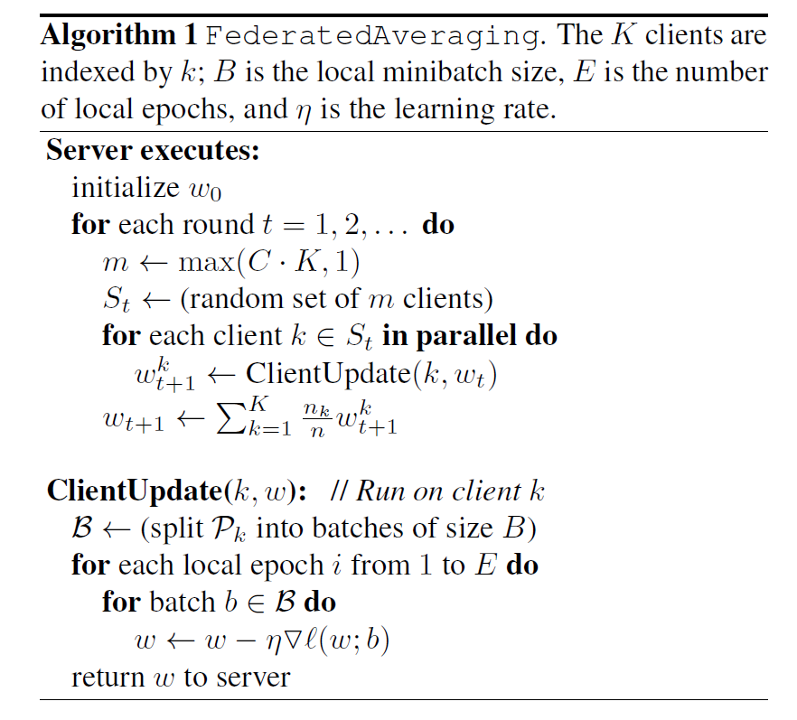
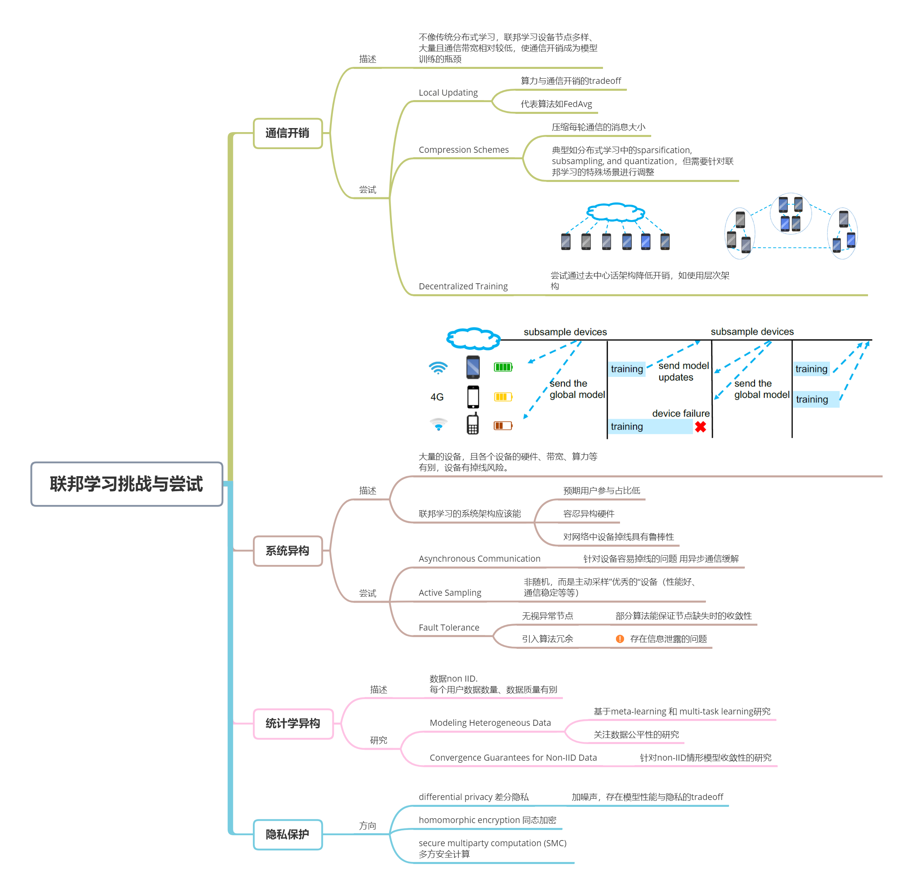

#　联邦学习02——读综述与谷歌开山论文的笔记

粗略阅读了谷歌关于联邦学习的两篇开山论文，及一篇2020年的综述，以思维导图方式总结联邦学习概念由来、面临挑战、未来方向如下。

> 本文总结自：
>
> Konečný, J., B. McMahan and D. Ramage (2015). "Federated optimization: Distributed optimization beyond the datacenter." arXiv preprint arXiv:1511.03575.
>
> McMahan, B., E. Moore, D. Ramage, S. Hampson and B. A. y Arcas (2017). Communication-efficient learning of deep networks from decentralized data. Artificial Intelligence and Statistics, PMLR.
>
> Li, T., A. K. Sahu, A. Talwalkar and V. Smith (2020). "Federated learning: Challenges, methods, and future directions." IEEE Signal Processing Magazine 37(3): 50-60.

<!--more-->

## 1. Google 奠基工作

工作首先介绍谷歌的任务场景，进而分析其特点，最后针对“通信开销”提出*FedAvg*算法。

**联邦学习的任务场景**

以谷歌开发的各类app为例，为了提供更好的服务，常需要采集广大用户app的相关信息来训练机器学习模型。传统做法是收集用户信息至中央服务器进行训练，然而用户隐私意识渐强，谷歌不便“直接作恶👀”。

于是，谷歌总结了适用联邦学习而非收集数据训练模型的问题场景：

1. 训练来自移动设备的真实数据比训练数据中心通常提供的代理数据具有明显的优势;
2. 此数据是隐私敏感的或较大的（与模型的大小相比），不适合上传到数据中心;
3. 对于监督任务，可以从用户交互中自然推断出数据上的标签（如键盘输入，预测下一个单词）。

**联邦学习任务特点**

从分布式学习出发，全局模型的优化目标可以记为：
$$
\min _{w \in \mathbb{R}^{d}} f(w) \quad \text { where } \quad f(w) \stackrel{\text { def }}{=} \frac{1}{n} \sum_{i=1}^{n} f_{i}(w)
$$
但与传统分布式学习不同的，联邦学习还具备如下任务特点：

- **Non-IID**：由于本地训练数据与具体用户相关，从而任意用户的数据集一般都不能反映全局数据分布，即各个本地数据集非独立同分布；
- **Unbalanced**：每个用户使用app频率不同，产生的数据量不同；
- **Massively distributed**：总参与模型训练的用户数远大于每轮参与迭代的用户数；
- **Limited communication**：不像传统分布式学习，节点间彼此通信开销低，手机设备常常会离线或通信缓慢，如上传带宽常低于1MB/s。

根据上述特点，优化目标可改写为：
$$
f(w)=\sum_{k=1}^{K} \frac{n_{k}}{n} F_{k}(w) \quad \text { where } \quad F_{k}(w)=\frac{1}{n_{k}} \sum_{i \in \mathcal{P}_{k}} f_{i}(w)
$$
其中，K为参与用户数，$n_k$为第k个用户本地训练数据大小，$P_k$为训练数据的索引，有$n_k=|P_k|$。

**FedAvg算法**

联邦学习场景中，通信是制约模型训练效率的一大瓶颈，为此，Google提出*FedAvg*算法，其核心思想是**本地多轮迭代后再上传梯度，用算力交换通信开销**。

可以发现，Google早期关于联邦学习的工作中，对隐私保护的关注度略少，仅把“数据留在本地”作为隐私保护的方法，而未解决上传参数、梯度时泄露信息等问题。

## 2. 综述梳理

联邦学习的相关研究近年来得到进一步发展，下面以导图形式树理"Federated learning: Challenges, methods, and future directions."，罗列联邦学习面临的挑战及概括的解决思路。

