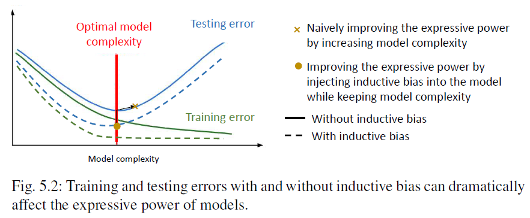
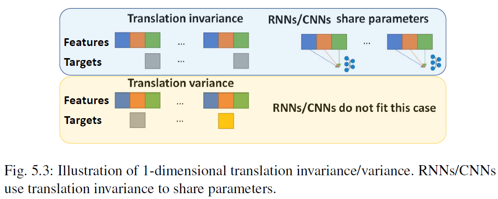
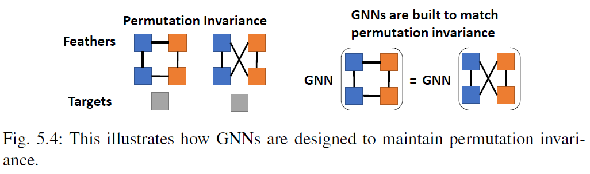
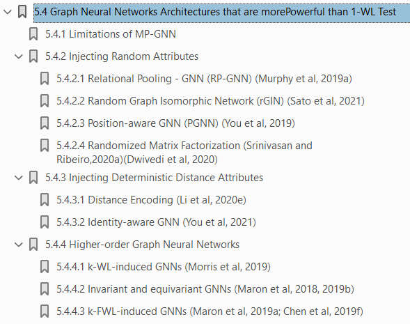
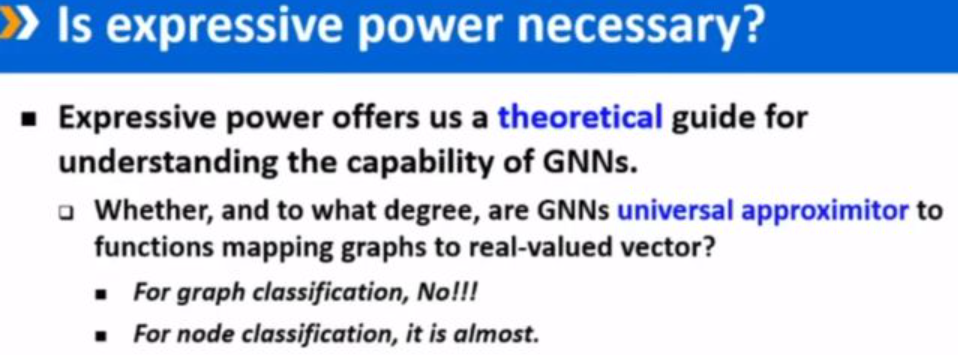
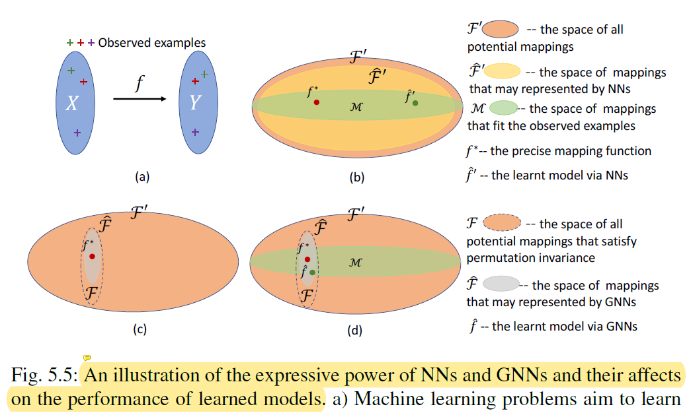

#  如何理解 GNN 表达能力的粗浅小结

> 参考阅读：
>
> 1. [Chapter5: The Expressive Power of Graph Neural Networks](https://graph-neural-networks.github.io/gnnbook_Chapter5.html)
> 2. [中科院计算所沈华伟：图神经网络表达能力的回顾和前沿](https://www.163.com/dy/article/FG0J275N0511DPVD.html)
> 3. [【ICLR2021论文解读】初探 GNN 表达能力](https://zhuanlan.zhihu.com/p/369869891)
> 4. [Analyzing the Expressive Power of Graph Neural Networks in a Spectral Perspective](https://openreview.net/forum?id=-qh0M9XWxnv)
> 4. [图神经网络的表达能力与置换同变性](https://www.cnblogs.com/hilbert9221/p/14443747.html)

## 1. 神经网络的表达能力

机器学习的任务，可以理解为存在一个从特征空间到目标空间的映射$f^*$，希望能用模型 $f_\theta$ 来近似$f^*$ 。可将 $f_\theta$ 能近似的**映射范围**理解为模型的表达能力。

先前研究已证明了定义任意定义在compact space上的连续函数都可被**MLP**近似。但其实，一方面并不能保证**模型经训练所学的$\hat{f}$ 是想近似的$f^*$**，另一方面过强的表达能力还可能导致overfitting。

因此，我们希望建立能够保持强大表达能力的NN，同时对其参数施加约束——归纳偏置反映着对问题的先验认知。

对于CNN/RNN，模型共享参数的机制隐含着translation invariance的假设，对模型的表达力进行限制，但已经能完成对应任务**(limited but sufficient)**。

对于GNN，则有如下图所示的permutation invariance限定。

## 2. GNN表达能力的不同视角

1. **区分能力(separating power)/相似性度量**：

   经典工作为 *How Powerful are Graph Neural Networks？*，它使用的**图同构检验graph isomorphism problem**来衡量GNN表达能力。表达力强的GNN能学到分辨性强的graph embedding，让我们**在隐空间中判定两个图是否同构**。

   进一步的，还可尝试探索GNN是否能处理更难的 **图编辑距离graph edit distance problem**。

2. **逼近能力(approximation power)**：

   基于**函数逼近**思路，关心神经网络能够**表达的函数的范围有多大**，工作举例有*EXPRESSIVE POWER OF INVARIANT AND EQUIVARIANT GRAPH NEURAL NETWORKS*。尝试证明GNN可以逼近的定义在图上的映射集合。

3. **模式识别**：

   通过研究GNN是否能识别图中的特定结构，把模式识别能力视作GNN的表达能力，工作举例有*Can graph neural networks count substructures?*。

## 3. 提升表达力方式（WL-test视角）

[Chapter5: The Expressive Power of Graph Neural Networks](https://graph-neural-networks.github.io/gnnbook_Chapter5.html)的5.4章给出了具体介绍，在此不赘述。

---

上述观察，主要都聚焦在graph-level研究GNN表达能力，而缺乏从node-level出发的表达能力讨论。

一说对于node-level任务，GNN已经是universal approximator，不必深入研究。（参考阅读2）

但另一方面，一直以来关于GNN架构的研究，除了提升其表达能力外，也在努力提升其拟合能力——使模型能从有限的训练数据中尽可能拟合ground  truth映射函数$f^*$。

或许可理论层面分析node-level层面GNN的表达能力、泛化能力（待阅读[How Neural Networks Extrapolate: From Feedforward to Graph Neural Networks. Keyulu Xu et al. ICLR 2021.](https://openreview.net/pdf?id=UH-cmocLJC)、[What Can Neural Networks Reason About? Keyulu X et al. ICLR2020](https://openreview.net/pdf?id=rJxbJeHFPS)）；

也可能参考上述他人证明，指导设计 theortical proven node-level specific GNN。
