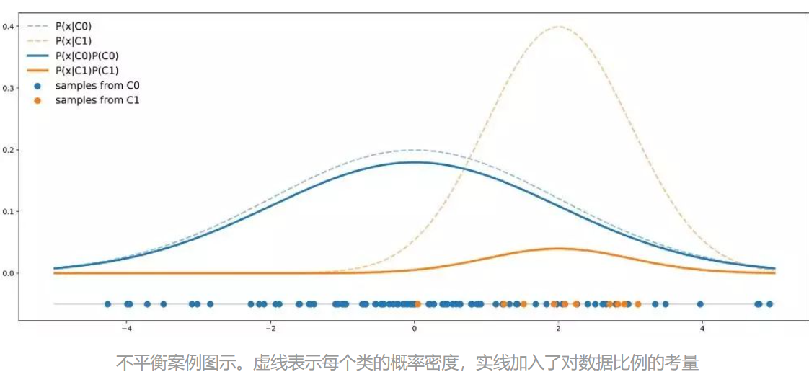
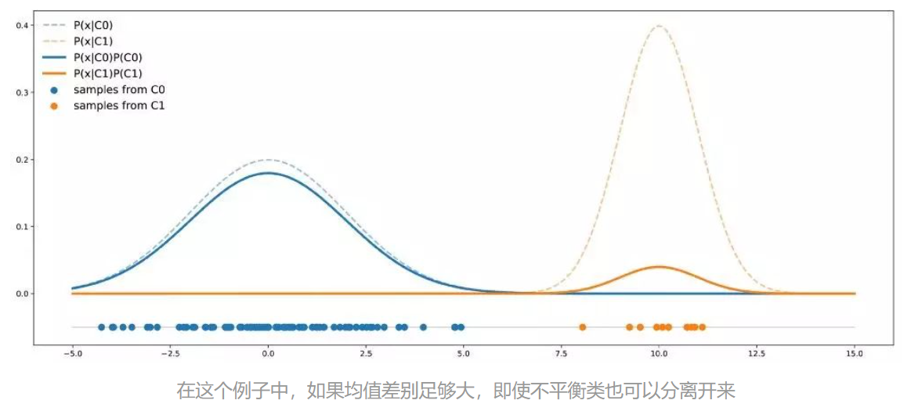

# 关于不平衡数据集的总结汇总

## 1. 从样本分布看问题根源

资料来源:[机器学习中如何处理不平衡数据？](https://zhuanlan.zhihu.com/p/56960799)

> 链接中通过例子重点分析unbalanced dataset的分布问题

往往由于现实因素限制，我们得到数据集中正负样例比例相差悬殊，可能导致如下情况：

如上图所示，尽管正负样例的实际分布不同（虚线部分），但由于采样比例悬殊（实线部分），若模型**仅仅追求高Accuracy**，模型则倾向于给出`predict=1`的结果。

不过，若正负样例的实际分布相差较大，就算数据集不平衡，模型也可能得到较好的分辨能力：

若想从根本上解决不平衡数据集问题，还是需要**采集更多负样本**。

## 2. 改进方式

[详细资料参考](https://www.jianshu.com/p/f170d72f6fb6)

基本思路如下：

### 2.1 采样方式

1. 欠采样/过采样
2. 数据合成（对负样本进行微小扰动等实现负样本合成）

### 2.2 建模方式

1. 模型训练中，**分配类别权重**或者样本权重；
2. 将问题视作看成一分类(One Class Learning)或者**异常检测**(Novelty Detection)问题；
3. Ensemble集成算法;

### 2.3 特征工程

从上文图2中可以发现，如果能创建出新特征，使各类样本的分布尽可能分离，也有可能提升分类器性能。

## 3. 其他问题

在面对不平衡数据集时需要选择合适的指标，

`Accuracy`, `AUC` 的结果不能真实反映分类器性能，关注`PR`曲线等能更好理解分类器在对不同类别样本的分类能力。

---

参考资料：

1. https://www.jianshu.com/p/f170d72f6fb6
2. https://zhuanlan.zhihu.com/p/56960799
3. https://blog.csdn.net/qidailiming1994/article/details/100159842
4. https://www.zhihu.com/question/323518703