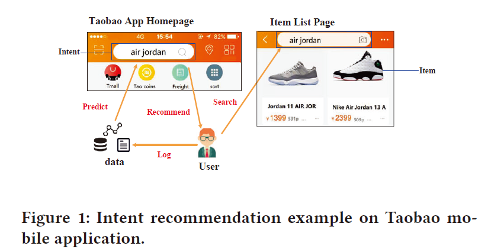
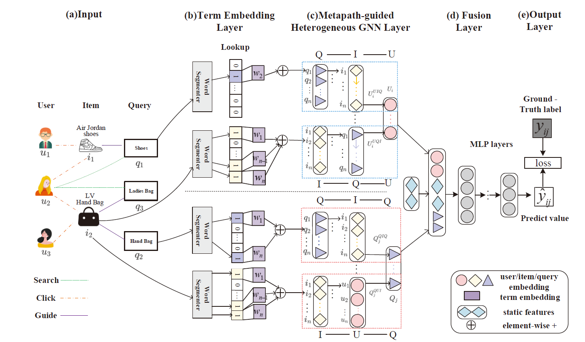
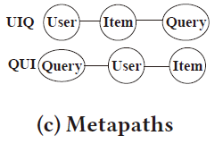

# Metapath-guided Heterogeneous Graph Neural Network for Intent Recommendation 个人总结

> 写在前面：为方便阅读，尽量使用中文总结，对于翻译无把握或专有词汇，在中文后附上原文字段


##  0. 原作信息

```
@inproceedings{fan2019metapath,
  title={Metapath-guided Heterogeneous Graph Neural Network for Intent Recommendation},
  author={Fan, Shaohua and Zhu, Junxiong and Han, Xiaotian and Shi, Chuan and Hu, Linmei and Ma, Biyu and Li, Yongliang},
  booktitle={Proceedings of the 25th ACM SIGKDD International Conference on Knowledge Discovery \& Data Mining},
  pages={2478--2486},
  year={2019}
} 
```


## 1.  Contributions 本文贡献 

- 提出基于词嵌入的预处理（propose a uniform term embedding mechanism）；
- 为**意图推荐**任务，设计基于异构图上metapath的模型**MEIRec**（ design a metapath-guided heterogeneous Graph Neural Network to learn the embeddings of objects）；
- 线下、线上实验都证明了模型的有效性。


## 2. Backgrounds 背景信息

### 2.1 意图推荐 （e-commerce intent recommendation）

例子：


- 输入数据类型：
  - 特征数据 attribute data
  - 交互数据 interaction data
- 与传统推荐系统的区别：
  1. 加入交互数据（点击等）
  2. 不需要用户输入字段（基于字段输入的联想推荐如，输入“小米”，系统给出“小米10Pro”等）


以图的结构建模：

> 注意，此HIN的边上无特征，只是不同关系的划分。


总的来说，意图推荐任务可使用更多类别的数据，同时要求更加个性化的推荐。


## 2.2 Metapath相关定义

1. Metapath定义：简单理解，在异构图中不同类型节点遍历的一条路径，如(User-Item-Query)

2. Metapath-guided Neighbors: 以上图为例，对于Metapath UIQ 上节点$u_2$，它的邻居为：$\mathcal{N}_{\mathrm{UIQ}}\left(u_{2}\right)=\left\{\mathcal{N}_{\mathrm{UIQ}}^{0}\left(u_{2}\right), \mathcal{N}_{\mathrm{UIQ}}^{1}\left(u_{2}\right), \mathcal{N}_{\mathrm{UIQ}}^{2}\left(u_{2}\right)\right\}=\left\{u_{2}, i_{1}, i_{2}, q_{1}, q_{2}, q_{3}\right\}$

   


## 3. MEIRec Model 建模

### 3.1 Overview 概览

任务：输入(User, Item, Query) 的图结构数据；输出User最可能的Query（意图推荐）




### 3.2 Uniform Term Embedding

实质(what)：**预处理**。将原始输入处理为合理的特征向量作为网络的输入。

- 面对问题(why)：输入的Query或Item作为一个整体特征👉大量高维、稀疏特征，参数过多不利于学习。
- 解决方案(how)：**分词**降维 + **Embedding**提取特征
  - 例子：输入Query“LV Hand Bags"，分词后得到terms{'LV','Hand','Bag'}
  - 分词使用阿里内部工具
  - Embedding：聚合每个term的embedding得到原始输入的embedding
  - $$E=g\left(e_{w_{1}}, e_{w_{n-1}}, e_{w_{n}}\right)$$


### 3.3 Metapath-guided HeGNN

- 基于对任务的理解，先验的定义**MetaPath**。

- 本层任务：聚合metapath上邻居节点的信息。


本文针对两种Metapath：QIU、IUQ建模，即本层最后输出的分别是$User Embedding:U_i$，$QueryEmbedding:Q_i$

接下来以**User Modeling**为例，说明如何产生$U_i$。


以图中上方的蓝框为例，对于用户$U_i$在Metapath上有一阶邻居$I$，二阶邻居$Q$。

1. $i_1$收集其对应邻居$Q$的embedding信息，

   $$I_{j}^{\mathrm{UIQ}}=g\left(E_{q_{1}}, E_{q_{2}}, \cdots\right)$$

   >  $g(·)$在论文中试验后，表示$avg(·)$性能最好

2. $U^{UIQ}_i$再收集其对应邻居$I$的embedding信息，

   $$U_{i}^{\mathrm{UIQ}}=g\left(I_{1}^{\mathrm{UIQ}}, I_{2}^{\mathrm{UIQ}}, \cdots\right)$$

   > 因用户查询或点击商品是线性时间上发生的， $g(·)$此处使用**LSTM**

3. 最后聚合得到真正的$U_i$

   $$U_{i}=g\left(U_{i}^{\rho_{1}}, U_{i}^{\rho_{2}}, \cdots, U_{i}^{\rho_{k}}\right)$$


### 3.4  Optimization Objective 优化对象

- 将graph embedding、static features连接后输入MLP做预测

  $$\hat{y}_{i j}=\operatorname{sigmoid}\left(f\left(U_{i} \oplus Q_{j} \oplus S_{i j}\right)\right)$$

- 损失函数设计

  $$J=\sum_{i, j \in \mathcal{Y} \cup \mathcal{Y}^{-}}\left(y_{i j} \log \hat{y}_{i j}+\left(1-y_{i j}\right) \log \left(1-\hat{y}_{i j}\right)\right)$$


## 4. Experiment

数据集：10天的淘宝内部数据，**亿级**节点数，**千万级**边数。

> 分别尝试使用1天、3天、5天的数据量 训练、测试

线下测试结果：

- 较baseline（GBDT+MP/DW）提升：2.1%~4.3%
- 和无使用异构信息的模型对比，证明引入异构信息是work的
- 模型伸缩性好，可用于大规模数据集
- 对于不同类型的邻居，应比对、选择合适的*aggregation function*，如模型中由先验分析+实验验证，对$Item -> User$ 选择了*LSTM*
- 模型性能、训练时长和邻居数量有关，前期呈正相关。

线上AB测试：比现有*GBDT*在各项指标小有增幅。


## -1. One more thing

对于个人建模的思考：

- 淘宝数据：
  - 没有使用边上特征
  - Intuitively，淘宝的图更稠密，每个用户都有一定的历史数据积累，相对交易支付数据等没那么稀疏
  - 图结构抽象很清晰，有效的分为{user, item, query}三部
- metapath的选取在此作中基于对业务的了解，先验知识。

