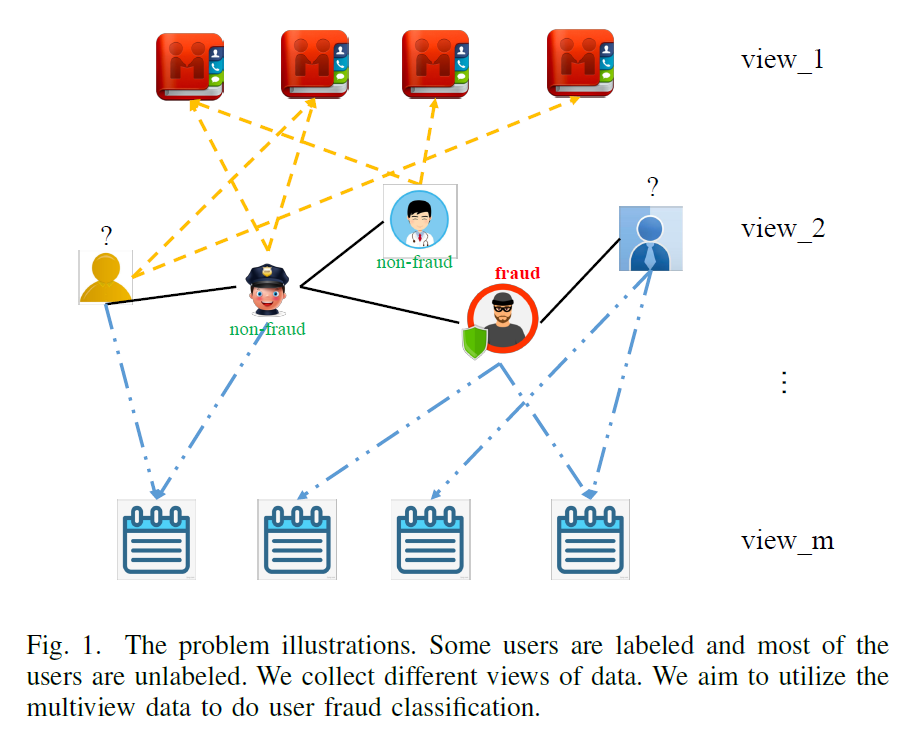
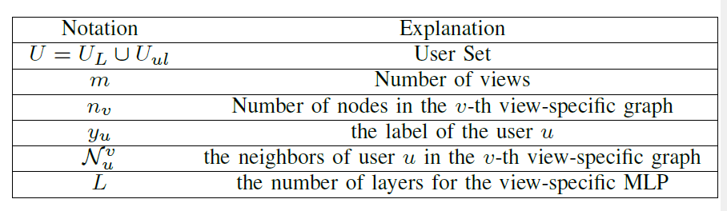
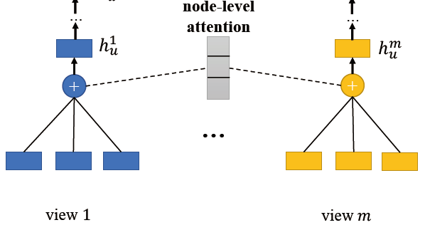
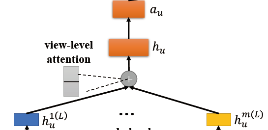
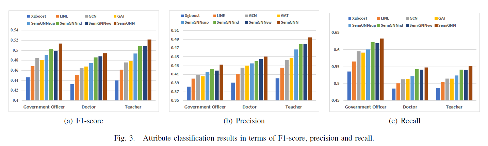

# A Semi-supervised Graph Attentive Network for Financial Fraud Detection 个人总结
> 写在前面：为方便阅读，尽量使用中文总结，对于翻译无把握或专有词汇，在中文后附上原文字段。此外，水平有限，对文章理解有偏差部分恳请大家海涵, 指正。


## 0. 原作信息

```
@inproceedings{wang2019semi,
  title={A Semi-supervised Graph Attentive Network for Financial Fraud Detection},
  author={Wang, Daixin and Lin, Jianbin and Cui, Peng and Jia, Quanhui and Wang, Zhen and Fang, Yanming and Yu, Quan and Zhou, Jun and Yang, Shuang and Qi, Yuan},
  booktitle={2019 IEEE International Conference on Data Mining (ICDM)},
  pages={598--607},
  year={2019},
  organization={IEEE}
}
```

## 1. Contribution 本文贡献

- 设计*semi-supervised GNN*，利用有标签、无标签数据。（通过设计不同$Loss$实现）

- 使用*Hieranchical Attention*，增加模型可解释性
- 在花呗的异构数据上很work。


## 2. Background　背景信息

- 任务: **欺诈检测,Fraud Detection**

  可视作分类任务,由于异常点的采集,标注极其耗费人力物力,数据集常为**少量有标签**数据(labeled data),及**大量无标签**数据(unlabeled data).

  模型需要具备**解释性**,  能向部署方, 被检测者说明检测的判别标准. 

- 过往检测方式

  - 基于规则, *Rule-based*
    - 原理:  假定欺诈活动基于一定可观测的模式
    - 缺点:  耗费人力手工设定, 依赖专家知识; 容易被攻击
  - 基于统计特征的机器学习模型
    - 如SVM, 树模型等
    - 缺点:  未利用用户间交互信息
  - 图表示学习的尝试
    - 黑箱模型,缺乏解释性

- 综上,欺诈检测建模有如下**灵魂三问**:

  1. 如何处理不平衡的数据,利用无标签的数据?  (semi-supervised)
  2. 如何利用用户间交互,及不同类别的特征?  (heterogenous graph)
  3. 如何保证模型可解释性?

## 3. The Model Semi-GNN 模型

### 3.1 Problem Definition and Notations 问题定义及注记

- 图的构建

  

  - 重点研究*User*用户类型节点, 图中有标签数据<<无标签数据
  - 异构图(文中记为*multiview graph*), $G^{v}=\left\{U \cup S^{v}, E^{v}\right\}, v \in\{1, \ldots, m\}$, $v$即view
  - view由具体业务确定, 本文中部分view是从用户特征处理产生的, 以增加结构信息. (详见实验部分数据集处理)
  
- 注记:

  

### 3.2 Overview 整体架构


node level(聚合各view内信息) → view level(整合views信息,得到对user的embedding)  →  relation loss ( 对有/无标签数据不同损失)


### 3.3 Node Level



对于节点*u*, *i*在view *v*中的特征表示, 设为$e_{u i}^{v}$

∵ 不同邻居节点对节点*u*的影响不同,  引入*Attention*来自主学习邻居节点的权重,

$$\alpha_{u i}^{v}=\frac{\exp \left(e_{u i}^{v} \cdot H_{u i}^{v}\right)}{\sum_{k \in \mathcal{N}_{u}^{v}} \exp \left(e_{u k}^{v} \cdot H_{u k}^{v}\right)}$$, 其中$H^v_u$为可学习的参数矩阵.

∴ 对于节点*u*在view*v*下的embedding,有:

$h_{u}^{v}=\sum_{k \in \mathcal{N}_{u}^{(A)}} \alpha_{u k} e_{u k}$

### 3.4 View Level



1. MLP

   > 个人理解即**预处理**, 但用MLP来映射总觉得有点偏, em, intuition?

   由*node-level*得到的$h^u_v$是属于各自view内(异构)的embedding, 为了聚合各个view时能更好的利用相互关联性(capture the multiview correlations),  首先用MLP将之映射到高维的语义空间(high-level semantic space).
   即有,
   $h_{u}^{v(l)}=\operatorname{Relu}\left(h_{u}^{v(l-1)} W_{l}^{v}+b_{l}^{v}\right), v \in\{2, \ldots, m\}$

2. View-Attention

   不同view对User的embedding影响也不同,同样,引入*Attention*来自适应. 

   $\alpha_{u}^{v}=\frac{\exp \left(h_{u}^{v(L)} \cdot \phi_{u}^{v}\right)}{\sum_{k \in\{1, \ldots, m\}} \exp \left(h_{u}^{k(L)} \cdot \phi_{u}^{k}\right)}, v \in\{1, \ldots, m\}$

最后, 连接在attention加权后各view节点表示,得到User的embedding.

$h_{u}=\|_{i=1}^{m}\left(\alpha_{u}^{v} \cdot h_{u}^{v(L)}\right)$

m为view个数,`||`为连接.

### 3.5 Loss 损失函数设计

1. 标签数据 

​	使用*softmax*

2. 无标签数据

   现象: **欺诈常呈团伙聚集, 标注为负样本的用户, 其邻居节点也可疑.**

   基于上述假设, 受DeepWalk启发, 作者设计的*Loss*希望:

   邻近节点的表示是相似的, 同时不同节点的表示差异较大. (encourages nearby nodes having similar representaions while makes the representations of disparate nodes distinct)

   听起来, 和聚类的要求是一致的, 更替了表述而已. 但为了实现上述期望, *Loss*的设计还是相当巧妙的. 

   ↓↓↓

   $\begin{aligned} \mathcal{L}_{\text {graph}}=& \sum_{u \in U} \sum_{v \in \mathcal{N}_{u} \cup N e g_{u}}-\log \left(\sigma\left(a_{u}^{T} a_{v}\right)\right) \\ &-Q \cdot E_{q \sim P_{n e g}(u)} \log \left(\sigma\left(a_{u}^{T} a_{q}\right)\right) \end{aligned}$

   其中, $\mathcal{N}_{u}$为节点*u*的邻居, $\mathcal{N}_{eg_u}$为节点*u*的被标记为负样本的邻居,  σ取*sigmoid()*, $P_{n e g}(u) \propto d_{u}^{0.75}$ 为负样本的采样分布, *Q*为采样的负样本数量(本文取3). 

   我们来按照每一项理解一下, 

   - $-\log \left(\sigma\left(a_{u}^{T} a_{v}\right)\right)$
      *u,v*为邻居, 我们希望两个节点的表示是相近的. 若$a_u,a_v$相近, 则其乘积$a^T_ua_v$较大, 取*sigmoid()*后接近1, 取对数后损失小, 符合我们设计*Loss*的期望.

      同理, 若$a_u,a_v$相差较大, 则*Loss*较大, 给出惩罚

   - $-Q \cdot E_{q \sim P_{n e g}(u)} \log \left(\sigma\left(a_{u}^{T} a_{q}\right)\right)$

      与上同理, 若邻居中有负样本, 则节点*u*也可疑, 其节点表示应与负样本节点相近.

   

   > 注意, 邻居节点*v*在模型中为*random walk path*上的点.

   

综上, 我们得到了整个模型的*Loss*,

$\mathcal{L}_{S e m i G N N}=\alpha \cdot \mathcal{L}_{s u p}+(1-\alpha) \cdot \mathcal{L}_{g r a p h}+\lambda \mathcal{L}_{r e g}$

### 3.6 模型分析

模型主要特点:

1. 综合使用异构多维的数据(multiview)
2. 可能有较好的解释性(attention)
3. 是归纳方法(inductive method), 训练完成后可部署于平台
4. 可并行训练的

## 4. Experiment 实验

### 4.1 Dataset 数据集

花呗内部数据: 大约4,000,000 有标签用户, 总共100, 000, 000用户.

预处理后, 保留有约90% 的用户, 这些用户的相关view数据确实较少.

预处理后构建了如下4个图(3种view):

1. user-relation(用户间关系)
2. user-app
3. user-nick
4. user-address

### 4.2 实验任务

1. user default prediction  用户违约预测
2. user attributes prediction 用户特征预测 (本文为用户职业预测)

### 4.3 实验结果

超越baseline小几个点.

user default prediction:


user attributes prediction :



> *SemiGNNsup*为只使用有标签数据的对照组.

结果表明, 在3.6模型分析中提到的优越性, 有助于提升模型性能.

作者后继还对模型参数敏感性, 不同view对性能的重要性进行了简要分析.


## -1. One More Thing

个人思考:

- 文章亮点:

  - semi-supervised learning 的*Loss*第一次接触, 略开眼界. 接下来对欺诈检测做进一步了解, 对比各类半监督方案.
  - 异构处理. 实质上异构数据是单独处理, 再通过Attention连接来做embedding, 从结果来尚算喜人.

- 一点疑惑:

  - 文章中的*XGBoost*估计没有精调? 在用户职业预测上, 由于有地址信息这一强特征, 个人猜测应该能达到更好的结果. 故模型和业务部署的baseline的差距有多大呢.

  - 模型的可解释性仍是薄弱.

    文中对模型可解释性的分析, 仅是基于对若干只采用单一view的模型性能做分析, 进而比较attention系数的差异.  