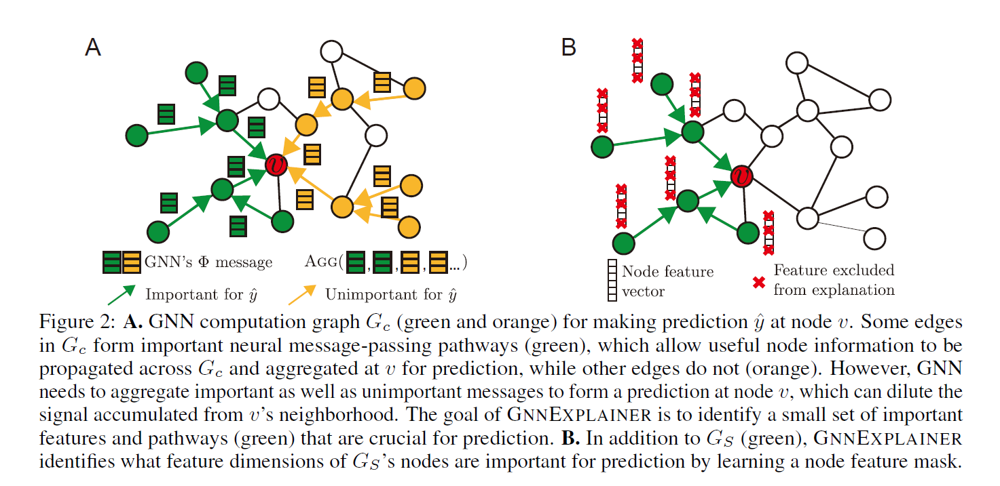
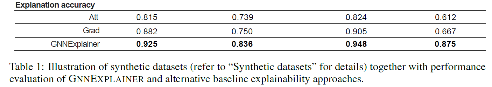
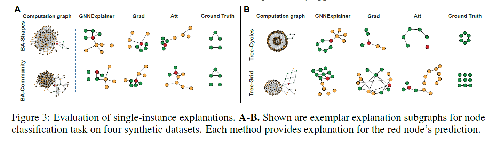
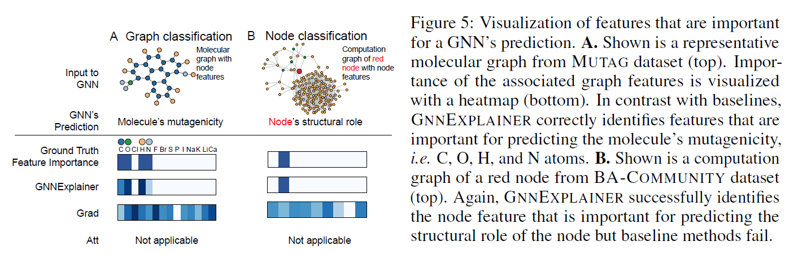

# GNNExplainer: Generating Explanations for Graph Neural Networks 个人总结

> 写在前面：为方便阅读，尽量使用中文总结，对于翻译无把握或专有词汇，在中文后附上原文字段。此外，水平有限，对文章理解有偏差部分恳请大家海涵, 指正。

## 0. 原作信息

```
@inproceedings{ying2019gnnexplainer,
  title={Gnnexplainer: Generating explanations for graph neural networks},
  author={Ying, Zhitao and Bourgeois, Dylan and You, Jiaxuan and Zitnik, Marinka and Leskovec, Jure},
  booktitle={Advances in Neural Information Processing Systems},
  pages={9240--9251},
  year={2019}
}
```


## 1. Contribution 本文贡献

- 提出第一款通用，模型无关的(model-agnostic)对于GNN模型的解释器**GNNEXPLAINER**

- 形式化描述**GNNEXPLAINER**为最大化互信息的优化任务

- 抽取重要的子图结构及节点特征子集，作为模型解释。

  

## 2.  Background 背景信息

对于非图结构的神经网络，解释方法主要有如下两个方向：

1. 为整个网络构建简单的代替模型

常为模型无关的(model-agnostic)，在待解释样本点的局部建立可信的估计。

E.g., 线性模型如*LIME*，规则集合如*ANN_DT*

2. 识别模型计算过程中的重要层面

E.g. 关注特征梯度(feature gradients)等。


对于图神经网络设计解释方法，除去节点特征外，还需要结合考虑**图的结构特征**。

## 3. Problem Formulation 问题定义

### 3.1 GNN回顾

抽象GNN基本操作如下：

给定GNN模型 $\Phi$ , 对于 $l$ 层节点$v$的特征表达求取，共经过如下3步。

1. 与其邻居节点进行信息传递：

   $m_{i j}^{l}=\operatorname{MSG}\left(\mathbf{h}_{i}^{l-1}, \mathbf{h}_{j}^{l-1}, r_{i j}\right)$

2. 聚合邻居节点信息：

   $M_{i}^{l}=\operatorname{AGG}\left(\left\{m_{i j}^{l} | v_{j} \in \mathcal{N}_{v_{i}}\right\}\right)$

3. 结合自身节点上层表达，生成本层节点表达

   $\mathbf{h}_{i}^{l}=\operatorname{UPDATE}\left(M_{i}^{l}, \mathbf{h}_{i}^{l-1}\right)$


### 3.2 GNNEXPLAINER: Problem formulation

对于节点$v$，其经过图神经网络后得到的embedding，由其对应的邻居节点及特征决定，分别计邻居组成的子图结构为$G_{c}(v)$，特征集合为$X_{c}(v)$，

则节点的预测输出为

$$\hat{y}=\Phi\left(G_{c}(v), X_{c}(v)\right)$$

解释器**GNNEXPLAINER**目标，即是提取出具备解释性的子图、特征子集$\left(G_{S}, X_{S}^{F}\right)$

具象化表示为下图：




## 4. GNNEXPLAINER

> 一系列公式推导，说明如何提取子图、子特征。


### 4.1 单一样本的解释 Single-instance explanations

设节点$v$的子图为$G_S$，有$G_{S} \subseteq G_{c}$，对应的有特征子集$X_S=\left\{x_{j} | v_{j} \in G_{S}\right\}$

我们想选取解释性的子图，则通过最大化**互信息**实现：

- $\max _{G_{S}} M I\left(Y,\left(G_{S}, X_{S}\right)\right)=H(Y)-H\left(Y | G=G_{S}, X=X_{S}\right)$

对于上式，由于**GNN**模型已经确定，故$H(Y)$是常数。

展开第二项条件熵，$H\left(Y | G=G_{S}, X=X_{S}\right)=-\mathbb{E}_{Y | G_{S}, X_{S}}\left[\log P_{\Phi}\left(Y | G=G_{S}, X=X_{S}\right)\right]$，为了求解一个紧致解，我们约束$\left|G_{S}\right| \leq K_{M}$，可以理解为降噪，滤去无效邻居。

因而，我们得到：

- $\min _{\mathcal{G}} \mathbb{E}_{G_{S} \sim \mathcal{G}} H\left(Y | G=G_{S}, X=X_{S}\right)$

基于*Jensen*不等式，假设为凸函数，我们能得到上界：

- $\min _{\mathcal{G}} H\left(Y | G=\mathbb{E}_{\mathcal{G}}\left[G_{S}\right], X=X_{S}\right)$

> 有意思的地方来了，作者大意是：效果很好，原理就别纠结了直接用就是。

显然，*GNN*是不满足凸函数假设的，但工作中发现基于上述目标函数，结合正则项，对于所学的局部最优解已经有较好的解释能力。

对于期望 $\mathbb{E}_{\mathcal{G}}\left[G_{S}\right]$，通过一个掩码来实现，$A_{c} \odot \sigma(M),$ where $M \in \mathbb{R}^{n \times n}$。即，实际解释器要学习的，即是掩码*M*。

进一步，一般我们希望了解“此样本为何被预测为某一个类别”，而不是对全局模型的理解。故进一步修改目标函数为：

- $\min _{M}-\sum_{c=1}^{C} \mathbb{1}[y=c] \log P_{\Phi}\left(Y=y | G=A_{c} \odot \sigma(M), X=X_{c}\right)$

### 4.2 节点特征选择 Node feature information

同理，也使用掩码实现。

$X_{S}^{F}=\left\{x_{j}^{F} | v_{j} \in G_{S}\right\}, \quad x_{j}^{F}=\left[x_{j, t_{1}}, \ldots, x_{j, t_{k}}\right]$ for $F_{t_{i}}=1$

综上，对于整个解释器，要优化的目标函数即是：

$\max _{G_{S}, F} M I\left(Y,\left(G_{S}, F\right)\right)=H(Y)-H\left(Y | G=G_{S}, X=X_{S}^{F}\right)=$

此外，paper中提到使用*reparametrization*的trick来学习参数掩码。

除却上述目标函数外，解释器还加入若干**正则项限制**，如

- element-wise entropy，鼓励掩码离散
- 惩罚过多非零项的掩码

### 4.3 样本子集的解释  Multi-instance explanations through graph prototypes

> 未完全看懂。

除了对于单个样本的解释，GNNEXPLAINER也能对样本子集进行解释，如给出某类样本的解释。

实现思路，个人理解为“想办法将问题转化为单样本的解释。故需要设计算法实现代表节点的创建及响应的邻接矩阵生成”。

基本步骤有2：

1. 选择参考节点（可通过对节点子集embeddings求平均实现）
2. 创建对应的邻接矩阵


## 5. Experiments 实验

> 实验设计、呈现都很巧妙，值得分析学习。


### 5.1 数据集

1. 人工合成数据集

   

   

2. 现实数据集

   1. *MUTAG*，化学分子数据集
   2. *REDDIT-BINARY*，论坛讨论数据集。用户为节点，用户间评论为边。


### 5.2 Baselines

> 做一个迁移当baselines。

- **GRAD**，基于梯度。
- **ATT**，使用GAT中的注意力权重。


### 5.3 Results 结果

- 定量
  - 

- 定性
  - 
  - 
  - 


## -1. One More Thing

个人思考:

对于单样本的输出解释，若是做一个模型无关的解释器，如下两个步骤的设计是关键：

1. 采样。

   对于GNN这样基于消息传递的模型，每个节点的输出肯定受其邻居节点的影响。如何有效采样，构建子图，值得考量。

2. 目标函数设计。

   如何设计一个目标函数？本篇工作使用最大化互信息，还可以设计别的吗，如何优化？


扩展阅读：

- LIME
- GraphLIME


参考资料：

略去了文章中关于平均场部分，相关数据知识补充在此：

- [平均场近似](https://www.jianshu.com/p/86c5d1e1ef93)
- [各种熵的理解](https://zhuanlan.zhihu.com/p/35379531)