# EvolveGCN: Evolving Graph Convolutional Networks for Dynamic Graphs 阅读笔记

> 写在前面：为方便阅读，尽量使用中文总结，对于翻译无把握或专有词汇，在中文后附上原文字段。此外，水平有限，对文章理解有偏差部分恳请大家海涵, 指正。

## 0.原作信息

```
@article{pareja2019evolvegcn,
  title={Evolvegcn: Evolving graph convolutional networks for dynamic graphs},
  author={Pareja, Aldo and Domeniconi, Giacomo and Chen, Jie and Ma, Tengfei and Suzumura, Toyotaro and Kanezashi, Hiroki and Kaler, Tim and Leisersen, Charles E},
  journal={arXiv preprint arXiv:1902.10191},
  year={2019}
}
```

## 1. Contribution 

本文提出了**EvolveGCN**模型，通过使用**RNN**(GRU/LSTM)来学习**GCN**的参数矩阵，实现对**动态网络**的学习。

不同于往常用RNN来更新GCN**节点embedding**的模型，**EvolveGCN**更关注模型本身，通过更新GCN的参数，提升了模型对图结构变化的适应性，更易更新。

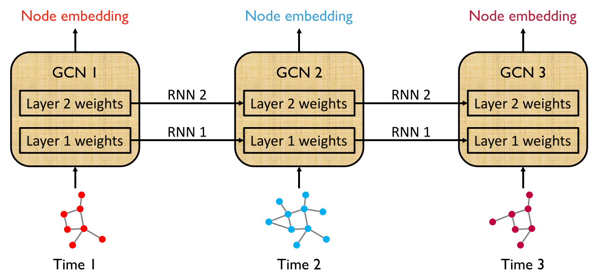

## 2. Motivation

动态图表示学习中，过往将RNN和GNN结合的模型，常将GNN作为特征提取器(**feature extrator**)产生node embedding，而使用RNN学习节点在时间序列中产生的node embeddings。

**局限**：

1. 图结构变化（结点增减）让RNN难以学习不规则行为下的node embeddings；
2. 需要结点在全部时间段的信息，且对于新结点的表示不稳定（无上下文信息）。


## 3. EvolveGCN

### 3.1 回顾GCN

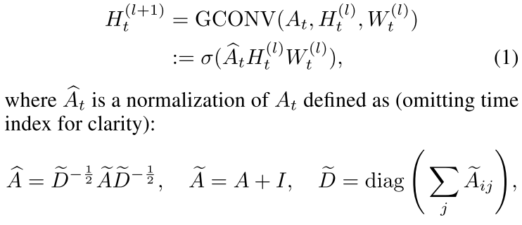

## 3.2 Weight Evolution 权重更新

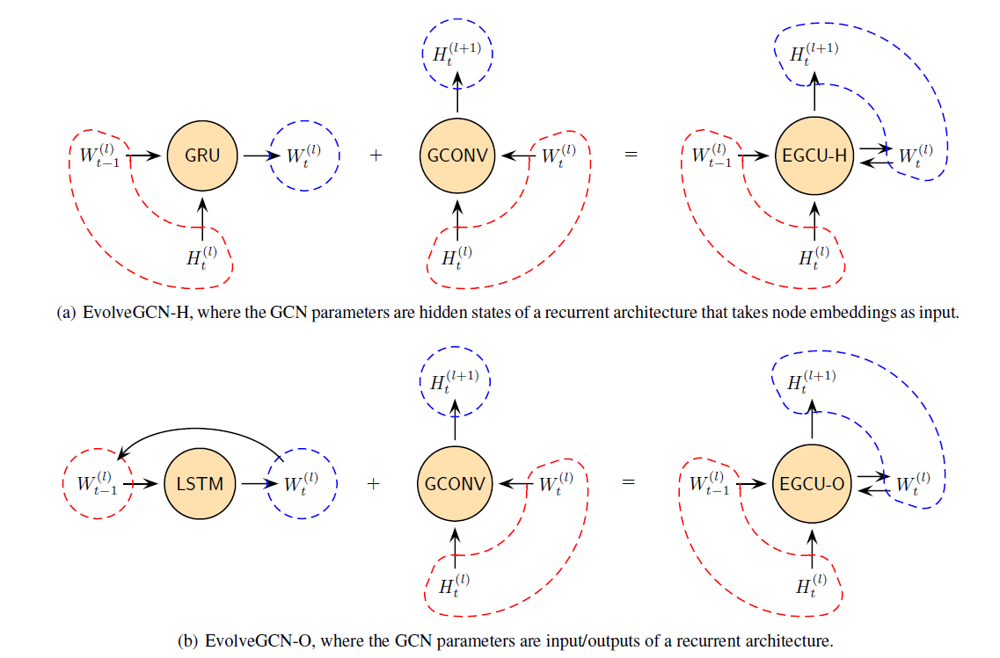

将多层EGCU（Evolving Graph Convolution Unit ）连接，每层输入一个时间步的图数据，即为EovlveGCN模型。

#### 3.2.1 EvolveGCN-H

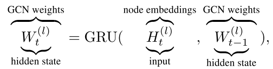

使用**GRU**更新权重，将权重作为**隐藏状态(hidden state)**，node embedding作为输入。

结合**GCN**，EvolveGCN-H单元计算过程如下：

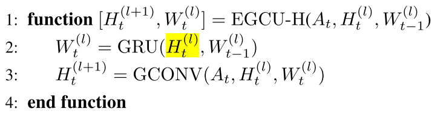

**实现**：

基于标准GRU实现，有如下两点拓展

1. 输入向量及隐藏态向量，变为**二维矩阵**；
2. 输入的node embeddings矩阵列数与参数权重矩阵**对齐**  


#### 3.2.2 EvolveGCN-O

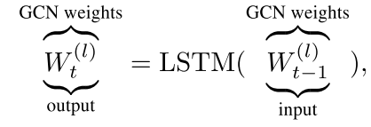

使用**LSTM**更新权重，将权重视为**输出(output)**，不使用 node embedding。

结合**GCN**，EvolveGCN-O单元计算过程如下：

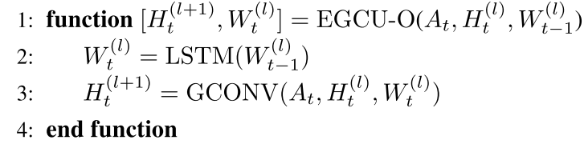

**实现**：

基于标准LSTM实现，将向量版本，变为**二维矩阵**版本即可。

#### 3.2.3 Which Version to Use

根据**数据集**情况进行选择：

- 结点具备强特征：使用有embeddings做input的GRU版本；
- 图结构更为重要：使用LSTM版本。


## 4. Experiments

### 4.1 数据集

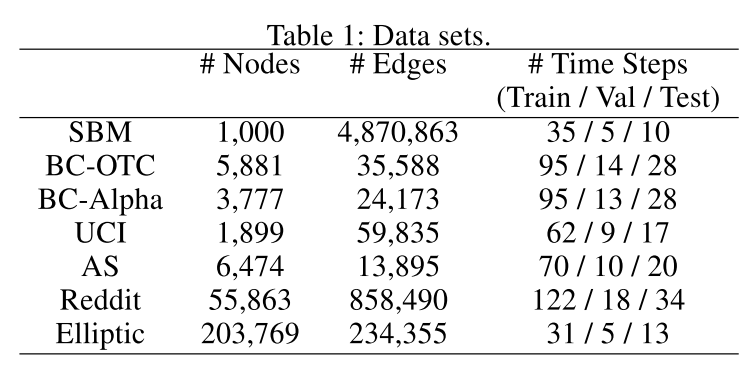

### 4.2 baselines

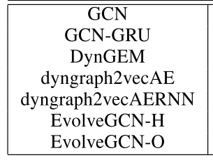

### 4.3 Link Prediction

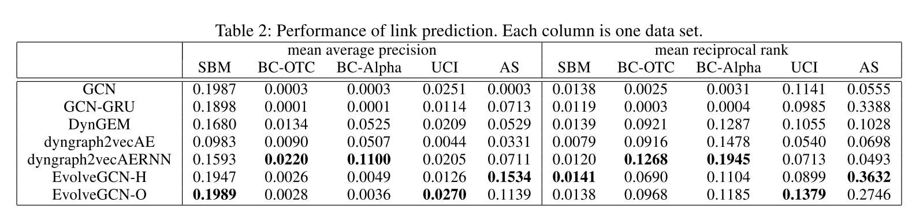

### 4.4 Edge Classification

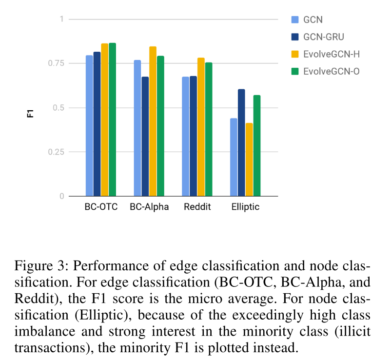

### 4.5 Node Classification

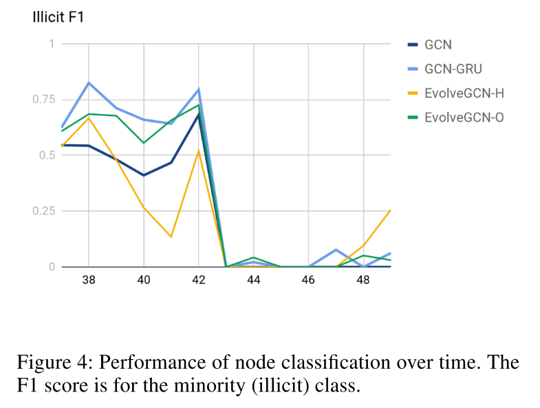

> 42时间步后的骤降，是由于比特币市场交易的突然关闭。


实验结果从指标上来看，EvolveGCN和其他动态图学习模型没有明显优势。


## -1. One more thing

- 仅通过RNN来训练权重参数，与过往参数训练的本质区别是什么？
- 无显式区分长短期结点记忆，是否有效？
- 缺少专门的动态图数据集，不同模型间难以有效比较性能。