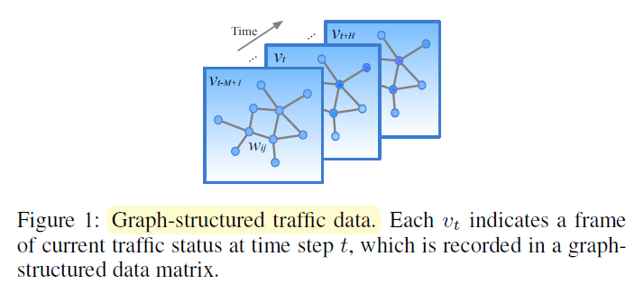
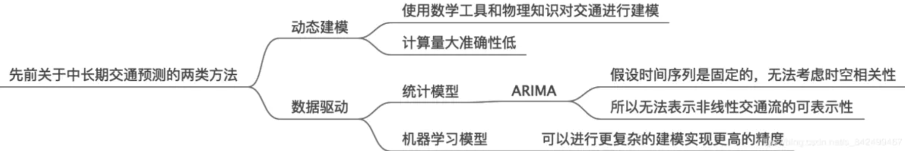
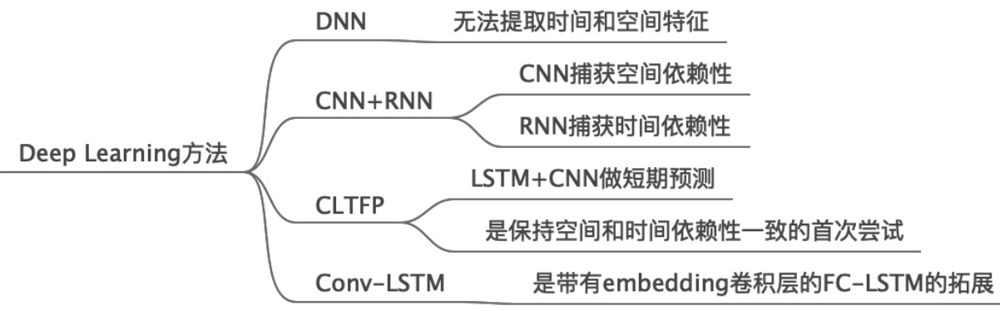
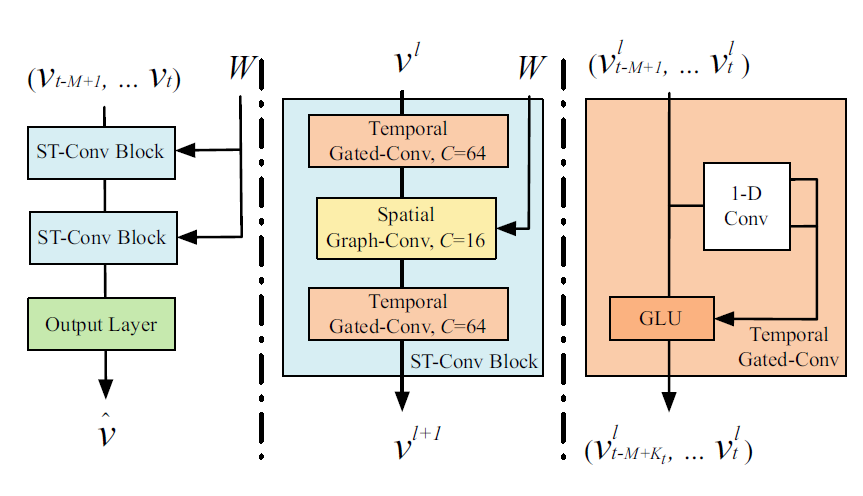
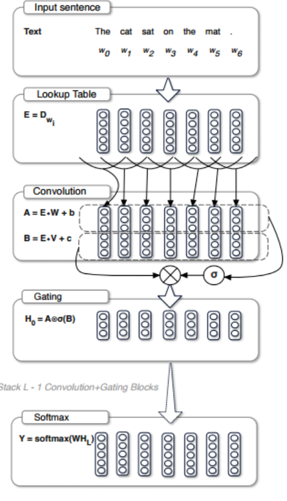
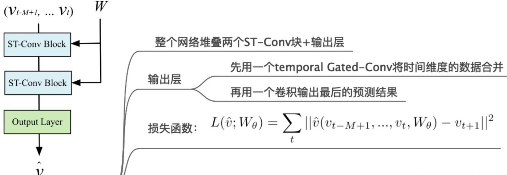
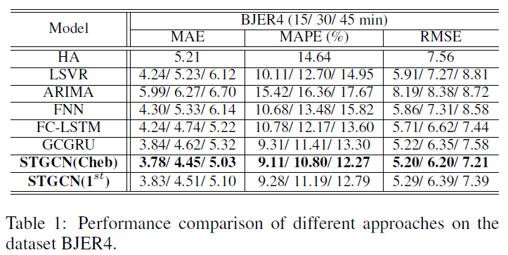
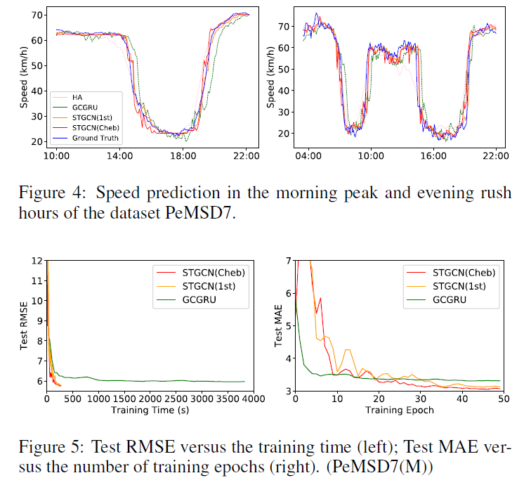
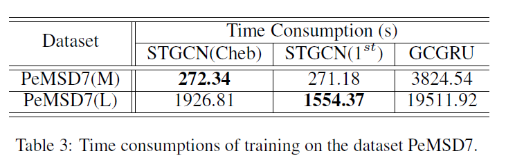

# Spatio-Temporal Graph Convolutional Networks: A Deep Learning Framework for Traffic Forecasting 笔记整理
# 0. 参考资料

```
@article{yu2017spatio,
  title={Spatio-temporal graph convolutional networks: A deep learning framework for traffic forecasting},
  author={Yu, Bing and Yin, Haoteng and Zhu, Zhanxing},
  journal={arXiv preprint arXiv:1709.04875},
  year={2017}
}
```

论文链接： [paper's link](https://www.ijcai.org/Proceedings/2018/0505.pdf), 发表在**IJCAI'18**

相关笔记：

- https://zhuanlan.zhihu.com/p/78259670
- https://www.jianshu.com/p/cafb2f188925
- https://zhuanlan.zhihu.com/p/129854363

# 1. Contributions

- 提出处理结构化时间序列的通用框架，STGCN 。它不仅能够解决交通网络建模和预测问题，而且可以应用于更一般的时空序列学习任务。
- 时空卷积块结合了图卷积(Chebyshev net)和门控时间卷积，在输入端实现并行化，参数更少，训练速度更快。


# 2. Preliminary

## 2.1 Traffic Prediction

交通预测是一种典型的时间序列预测问题，通过给定过去观察到的步测度（可以是速度、交通流等）来预测接下来的步测度：

$\hat{v}_{t+1}, \cdots, \hat{v}_{t+H}=\operatorname{argmaxlog}\left(P\left(v_{t+1}, \cdots, v_{t+H} | v_{t-M+1}, \cdots, v_{t}\right)\right.$

其中 ![[公式]](https://www.zhihu.com/equation?tex=v_t%E2%88%88R%5E%7Bn%C3%97C_i+%7D) 表示时间步 ![[公式]](https://www.zhihu.com/equation?tex=t) 时 ![[公式]](https://www.zhihu.com/equation?tex=n) 个观测点的观测向量（ ![[公式]](https://www.zhihu.com/equation?tex=C_i) 是数据的特征向量长度）。


本篇论文主要是对地点的速度进行中长期（大于30分钟）预测。

## 2.2 Road Graphs



本文使用39000个传感器来收集数据，每个传感器构成图中的一个节点。每30s进行一次数据采样，每5min的数据聚合成一张图，每 $M$张图构成一条数据（时空图）。

即$\mathcal{G}_{t}=\left(\mathcal{V}_{t}, \mathcal{E}\right)$，$G=\mathcal{G}_{1..t}$，为**结构不变，特征随采样快照变化而变化的动态图**。

## 2.3 Previous works






# 3. STGCN



网络输入是 $M$个时间步的图的特征向量 $X \in R^{M \times n \times C_{i}}$ 以及对应的邻接矩阵 $W \in R^{n \times n}$，$n$为结点个数，$C_{i}$为特征向量长度，经过两个时空卷积块和一个输出层，输出 $\hat{v} \in R^{n}$ 来预测第 $t$个时间步后某个时刻的图状态。

## 3.1 Gated CNNs for Extracting Temporal Features

作者分析：

- **RNN**类模型，受极为耗时的迭代制约，门机制过于复杂，且对于动态变化响应缓慢。
- **CNN**类模型，训练速度快，结构简单，无与上一步无独立性约束。

### 3.1.1 时域卷积

每个节点处的输入 ![[公式]](https://www.zhihu.com/equation?tex=X%E2%88%88R%5E%7BM%C3%97C_i+%7D)，沿着**时间维度**进行一维因果卷积(1-D causal convolution)，卷积核 ![[公式]](https://www.zhihu.com/equation?tex=%CE%93%E2%88%88R%5E%7BK_t%C3%97C_i+%7D)，个数为 ![[公式]](https://www.zhihu.com/equation?tex=2C_o)，从而得到 ![[公式]](https://www.zhihu.com/equation?tex=%5BP+Q%5D%E2%88%88R%5E%7B%28M-K_t%2B1%29%C3%972C_o+%7D)。

然后进行 ![[公式]](https://www.zhihu.com/equation?tex=GLU)激活：

![[公式]](https://www.zhihu.com/equation?tex=%CE%93%2A_%CF%84+X%3DP%E2%8A%99%CF%83%28Q%29%E2%88%88R%5E%7B%28M-K_t%2B1%29%C3%97C_o+%7D)

对于一张完整的时空图：输入 ![[公式]](https://www.zhihu.com/equation?tex=X%E2%88%88R%5E%7BM%C3%97n%C3%97C_i+%7D)，输出 ![[公式]](https://www.zhihu.com/equation?tex=Y%E2%88%88R%5E%7B%28M-K_t%2B1%29%C3%97n%C3%97C_o+%7D)。

### 3.1.2 (补充) GLU

> 由*Language Modeling with Gated Convolutional Networks*中提出。



- 最初应用：机器翻译

- 目的：缓解梯度传播，降低梯度弥散等现象
- 实现：使用**双倍**输出通道数的**卷积核**，一半的卷积输出进行*sigmoid*变换（**门控**）后与另一半卷积输出相乘。


### 3.1.3 (补充) Causal Convolution

对与序列问题（sequence modeling），主要抽象为，根据$x_1...x_t$和$y_1...y_{t-1}$去预测$y_t$，使得$y_t$接近于实际值。

Causal Conv 形式化描述：$p(\mathbf{x})=\prod_{t=1}^{T} p\left(x_{t} | x_{1}, \ldots, x_{t-1}\right)$

在实现上，1D的casual 主要通过padding来实现。


存在一个问题：当卷积核大小不变时，若要考虑到更远时间的输入，则需要加深层数。加深层数，意为着容易梯度爆炸/消失。

为解决这个问题，后又提出了**Dilated Conv**。


## 3.2 Graph CNNs for Extracting Spatial Features

使用**Chebyshev**图卷积。

## 3.3 Model



# 4. Experiments

## 4.1 数据集

1. BJER4 北京No.4路；
2. PeMSD7 加利福尼亚，39,000个传感器。

## 4.2 结果

- 

  本文提出的STGCN效果最好；同时还试验了一阶切比雪夫GCN的效果，略差与**Chebyshev**;

- 

  - 在速度大幅变化时，STGCN比GCGRU准确
  - 在速度值最低点上，STGCNA的预测也更加准确
  - 因为STGCN在时域上使用CNN，对历史数据的依赖比RNN更低

- 


# -1. One more thing

对于**交通预测**这特定场景，**STGCN**的设计不可谓不精巧，使用了*GLU*, *Bottle Neck*等技巧，使用那时主流的切比雪夫图卷积，取得不错的效果。

更多的，

- 有否将此模型，应用到**结构会变化**的动态图呢？
- 对于新的数据，模型只能重新训练；
- 最关键的，**causal conv**对于时序信息的学习，是否适合其他数据集呢？