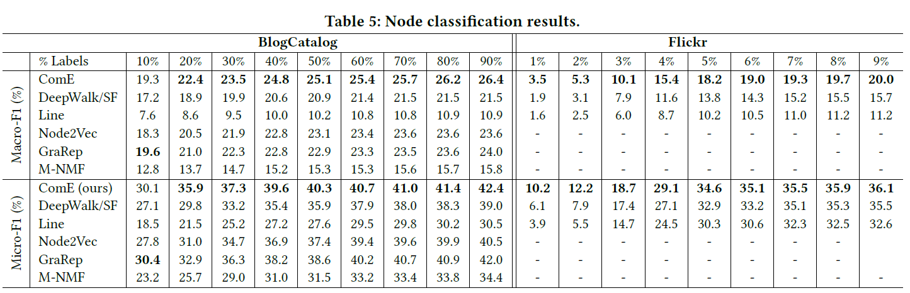

# 论文分享《Learning community embedding with community detection and node embedding on graphs》

> 论文链接：https://sentic.net/community-embedding.pdf
>
> 论文会议：**CIKM 2017**

## 1. Abstract

### 1.1 What do they do

引入多元高斯分布来描述社区embedding，在LINE的基础上结合社区embedding来同时实现node embedding learning 和 社区发现任务。

### 1.2 What's amazing points

- 使用multivariate Gaussian distribution 多元高斯分布建模社区 ( learn community embedding)；
- 设计端到端的训练模型，同步学习node embedding，多元高斯分布参数并更新社区发现结果。

### 1.3 Learning model

- graph：non-attributed graph
- unsupervised learning
- task：non-overlapped community detection
- learning model: Skip-gram based


## 2. Motivation


考虑上图3个任务，各自结果有助于提升彼此：

1. ① 好的node embedding能捕获图的结构、去除噪音，使用该embedding做输入，有助于community detection；
2. ② 精准的社区发现结果是进行community embedding的基础，因为community embedding是对社区节点特征分布的一种描述；
3. ③ 引入community embedding，可以理解为引入了**high-order information**，能让node embeding更好的关注全局结构信息。

关于③，如下图所示：


- 节点3、10为一阶邻居，但属于不同社区。仅基于first-order proximity的模型无法把握此结构信息；
- 节点9、10共享了许多二阶邻居，但二者属于不同社区，基于second-order proximity的模型不易描述此差异。

**Q: 上述3个任务用pipeline实现？**

A：可以，如a. 首先用spectral clustering进行社区发现；b. 学习node embedding；c. 基于社区发现结果和node embedding，学习一个分布，以该分布的参数来描述社区(即community embedding)

不过，上述pipeline有缺陷：

1. node embedding方法未引入社区信息；
2. 3个任务独立，无法联合优化训练。


## 3. Model

基于上述motivation，本文提出end-to-end的模型ComE来同步完成上述3个任务。

### 3.0 前导知识

- [高斯混合模型 GMM](https://zhuanlan.zhihu.com/p/30483076)
- [Skip-gram based 图表示学习](https://zhuanlan.zhihu.com/p/64991884)

### 3.1 Community detection & embedding

本文基于高斯混合模型，假设同社区的node embedding符合正态分布，多个社区的节点混合，组成了多元正态分布。由此，假设每个node embedding $\phi_{i}$是由其对应的社区$z_i=k$生成的。

我们有如下似然：


其中，


对应commnity detection 任务，节点$i$所属社区$k$为最大概率$p(z_i=k)$，下文记作$\pi_{ik}$。

对应community embedding任务，给定输入node embedding $\Phi$，我们目标是学习最合适的$(\Psi, \Sigma)$。

### 3.2 Node embedding & Loss function

基于LINE，有对应一阶、二阶相似性的目标函数：


同时，希望同社区内node embedding相近，设计有：


故模型最终的损失函数为：


### 3.3 Inference(略)

文章进一步讨论了如何实现对上述损失函数的优化，详情略。

简略伪码如下：

```
Initialize Φ and Φ′ by DeepWalk
for i in range(iterations):
	Fix (Φ, Φ′), optimize (Π, Ψ, Σ).
	Fix (Π, Ψ, Σ), optimize (Φ, Φ′).
```


## 4. Experiments(略)

本工作就模型进行全面的实验，包括1. graph visualization; 2. community detection; 3. node classification; 4. model study.

### 4.1 baselines

- SF: straightforward approach, 与本工作做对照的pipeline。分别使用：Spectral Clustering  for community detection; DeepWalk for node embedding; use GMM to fit community
- DeepWalk, LINE, Node2Vec, GraRep: Skip-gram based model
- M-NMF: non-negative matrix factorization based

### 4.2 Graph Visualization


### 4.3 Community Detection


### 4.4 Node Classification




> **Flickr**数据集中缺失项，是由于模型训练爆内存无法完成

### 4.5 Model Study


## 5. Thoughts

1. 为什么用GMM建模社区？社区结构用GMM描述合适吗？
2. 除了用多元高斯分布，如何更显式的建模社区结构？
3. motivation 阐述的Loop中，community embedding是否真的有必要？