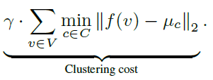
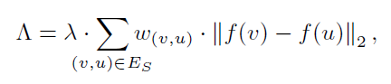
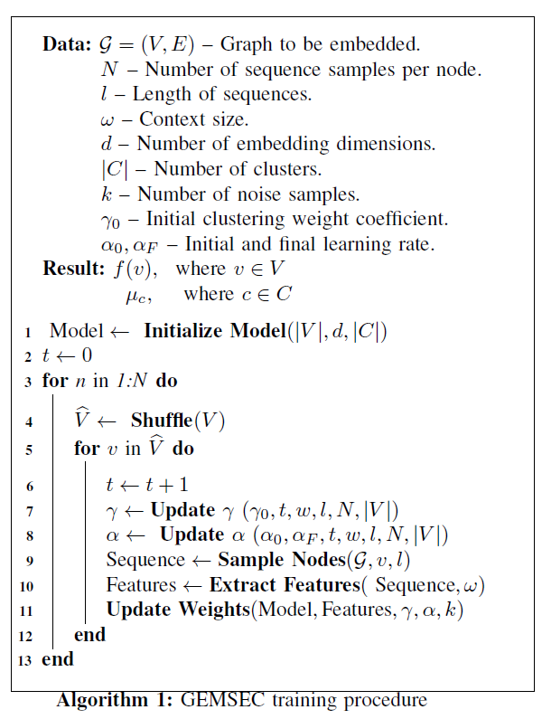

# 论文小记《GEMSEC: Graph Embedding with Self Clustering》

> 论文链接：https://arxiv.org/abs/1802.03997
>
> 论文会议：ASONAM, 2019
>
> 论文代码：https://github.com/benedekrozemberczki/GEMSEC

## 1. Abstract

### 1.1 What do they do

工作基于Skip-gram提出**GEMSEC**模型，通过在损失函数中加入clustering cost来要求社区节点表示的近似性，该模型能同步完成节点嵌入学习和社区发现。

### 1.2 What's amazing points

- 类似**K-Means**，通过计算节点与所属的聚类中心距离，设计clustering lost；
- 基于对社交网络中“同社区内邻居节点高度重合”的观察，设计regularization term来降低参数敏感性

### 1.3 Learning model

- graph：non-attributed graph
- unsupervised learning
- task：non-overlapped community detection
- learning model: Skip-gram based

## 2. Motivation

- 借助**K-Means**算法思路来描述节点与社区（聚类）的关系；
- 在社交网络中，同属一个社区的节点可能有许多相同的朋友，这意味着社区中**节点邻居重叠度很高**。

## 3. Model

### 3.1 Clustering Cost

$f(v)$即节点$v$的嵌入表示，$\mu_c$为第$c$个社区(或理解为cluster)的社区中心向量表示。

clustering cost目标是最小化节点嵌入和其社区中心的距离，使得同社区节点的表示近似。

## 3.2 Smoothness Regularization

基于motivation中第二点对社交网络的观察，提出如下正则项：

其中，$w(v,u)$为节点间邻居重叠度，即$\frac{N(a) \cap N(b)}{N(a) \cup N(b)}$。

所以，上式可以理解为：

- 节点$u,v$共享邻居越多，越可能同属一个社区，于是$w(v,u)$趋近1，则两节点的嵌入表示应当相近；
- 反之，共享邻居少，$w(v,u)$趋近0，则不强求二者表示相近。

### 3.3 others

本工作还讨论了learning rate及其他超参的退火调整，整个模型算法伪码如下：

## 4. Thoughts

- 与**KMeans**局限性类似，本工作发现的社区是否很大程度受聚类中心节点初始化的影响；
- 比起得到embedding后再用**KMeans**，本工作简单的走多一步但取得更好的效果——大约还是要多实验、并自信地发出来吧。