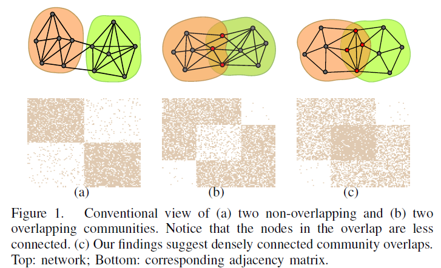
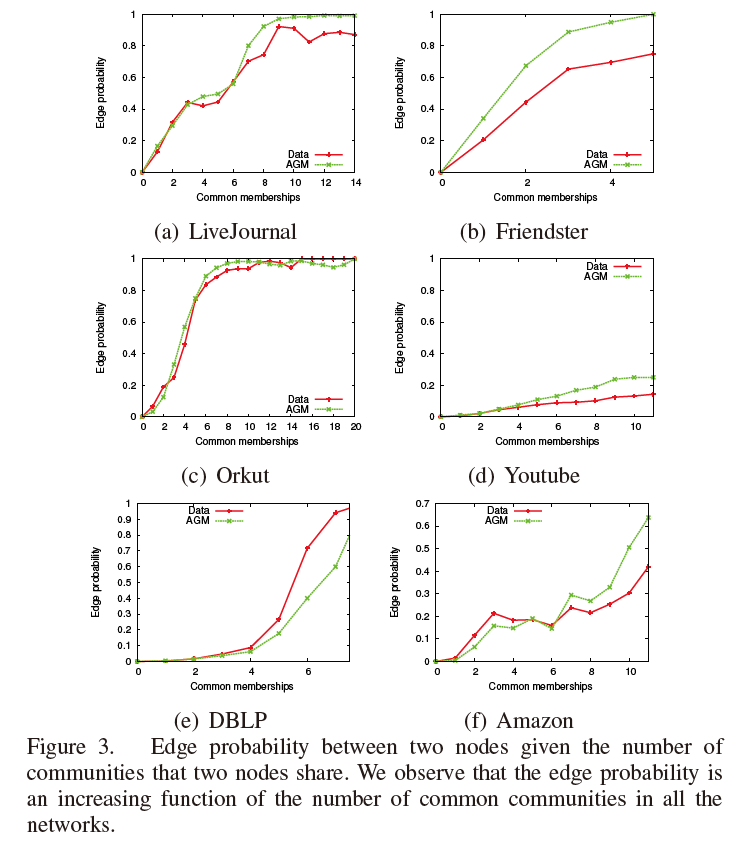
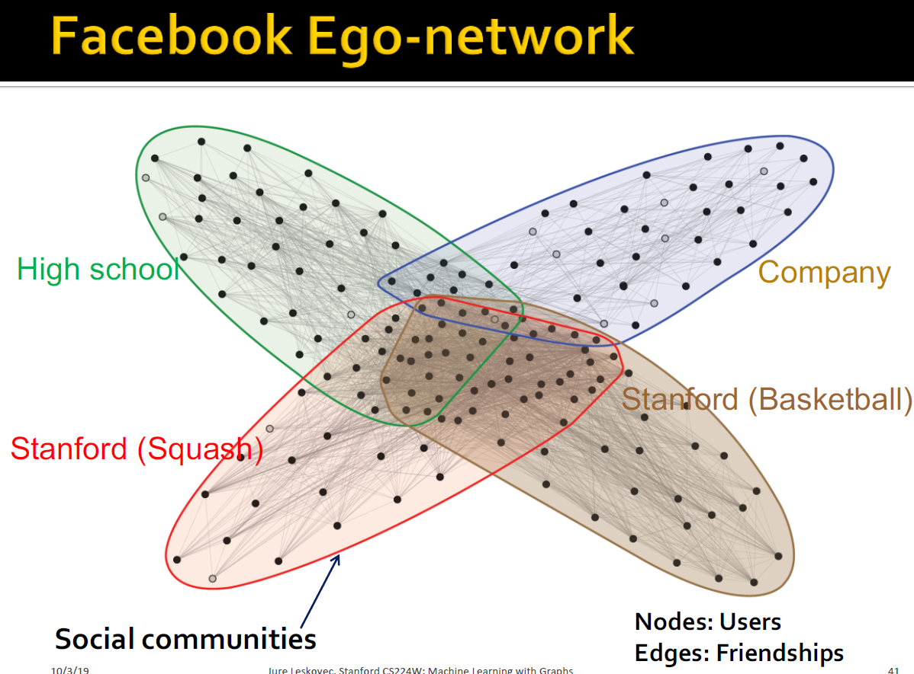
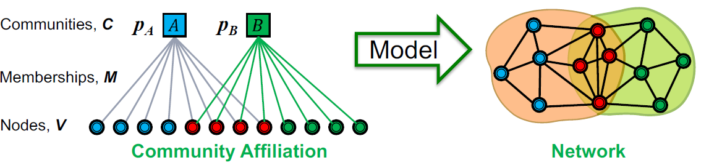
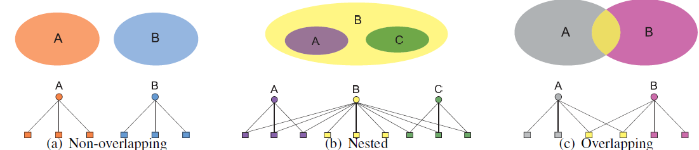
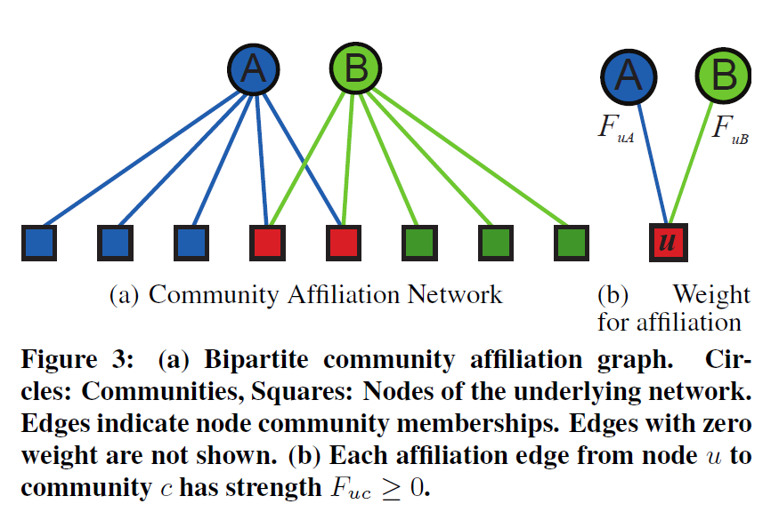

# 论文分享《Community-affiliation graph model for overlapping network community detection》

> 日期： 2021. 12. 05
>
> 论文链接：https://cs.stanford.edu/~jure/pubs/agmfit-icdm12.pdf
>
> 论文会议：ICDM, 2012


## 1. Abstract

### 1.1 What do they do

对现实数据中重叠社区的分布进行研究，提出社区-节点的二分图模型**AGM**，并基于**AGM**设计算法完成重叠社区发现任务。

### 1.2 What's amazing points

1. 通过数据挖掘研究**社区重叠部分节点对间边的稠密程度**，反驳过往重叠社区发现工作的基础假设；
2. 设计的图生成模型**AGM**能简洁的描述多种社区重叠情况（non-overlap/overlap/nested)


### 1.3 Learning model

- graph: non-attributed, unweighted graph
- unsupervised learning
- task: overlapped community detection


## 2. Motivation

- Assumptions comparison

  

  - 过往模型假设：社区重叠部分节点对间边是**稀疏的**；
  - 本工作发现：社区重叠部分节点对间边是**稠密的**，即，**节点对间所属相同的社区越多，节点对间越有可能有边**。

- Empirical Observations

  - 实验：

    

    > 分别为social network, co-purchasing network, collaboration network

    研究边的分布表明，随着节点对所属相同社区越多，该节点对间有边的概率越大。

    作为对比，实验还计算了图中随机两个节点间有边的概率 ≈ $10^{-5}$

  - 解读：

    作者以人际关系举例，诸如“兴趣”、”亲属关系“相近的越多，两人越有可能有联系，又如蛋白质中拥有越多相同的功能模块，越有可能发生交互。

    

    > 引 *Stanford CS224w* slide 直观示例

## 3. Model

### 3.1 Community-affiliation graph model (AGM)

- 工作提出的模型主要基于两个要素：

    1. 社区出现的原因，是源自节点有相近的隶属关系(shared group affiliations)
    2. 基于如下事实：人们属于多个社区（朋友，家人和同事），但人们间的联系主要由于某一个主要原因。

- 模型定义（参见下图）

    有二分图 $B(V,C,M)$， $V,C$分别为节点集合、社区集合，$(u, c) \in M$ 意味着节点$u$属于社区$c$；

    此外，有对社区集合有概率集 ${p_c}$, $p_c$表示 ”同属于社区$c$的节点对间生成边的概率，

    所以，给定$B, V$， 我们能生成图 $G(V,E)$，通过如下概率方式决定图中边的生成：

    $$p(u, v)=1-\prod_{k \in C_{u v}}\left(1-p_{k}\right)$$

    > 即P(u,v 有边) = 1 - P(u, v 在任何一个共同社区概率$p_c$下都没能生成边)



- 模型表达灵活性

  对于重叠/嵌入/非重叠的社区都能描述

  

### 3.2 AGM for Community Detection

任务：给定无向无权图$G(V,E)$，通过拟合**AGM**，求最大似然的方式进行重叠社区发现。

似然函数：

$$\underset{B,\left\{p_{c}\right\}}{\operatorname{argmax}} L\left(B,\left\{p_{c}\right\}\right)=\prod_{(u, v) \in E} p(u, v) \prod_{(u, v) \notin E}(1-p(u, v))$$

伪码：

```
for iterations to convergence:
	fixed B, update {pc} by gradient descent
    fixed {pc}, update B # use the Metropolis-Hastings algorithm
```


### 3.3 Others

- ε-community

  上述模型，生成的图中对于无共同社区的节点对，不能生成边，这与实际图的情况不符。

  为此，引入一个ε-community，所有节点都属于该社区，设置$p_c=\varepsilon=2|E| /|V|(|V|-1)$，由此，任意节点能以较低概率生成边。

- the number of community 

  **AGM**中社区的数量为超参，为了找出合适的社区数量，本工作通过：

  设置较大数值的社区($\left|C_{0}\right|=O(|V|)$)，训练一个初始的模型，并施加**L1**罚项，有

  $\left\{\hat{p}_{c}(\lambda)\right\}=\underset{\left\{p_{c}\right\}}{\operatorname{argmax}} P\left(G \mid B_{0},\left\{p_{c}\right\}\right)-\lambda \sum_{c}\left|p_{c}\right|$

  训练后统计$pc$不为零的个数作为实际社区数进行模型训练。

## 4. Later works (个人补充)

- **BIGCLAM**

  > *Overlapping Community Detection at Scale: A Nonnegative Matrix Factorization Approach*

  可理解为对*AGM*约束放松的模型，即每个结点属于对应社区的概率是连续且独立的，而非统一的$pc$, 

  即得到 隶属权重矩阵 $F \in{|V|}$ x  $|C|$, 每行表示结点$u$属于社区$c_1,c_2,...,c_k$的权重。

  见下图：

  

- **CommunityGAN**

  > $CommunityGAN: Community Detection with Generative Adversarial Nets$

  将AGM中节点对的生成，扩展为clique的生成，将AGM结合入GAN中完成社区发现.


## 5. Thoughts

1. 工作基于数据集研究所得结论进行了简洁的图生成模型建模，生成方式依照“所属相同社区越多，节点对越可能有边”。但单纯从图生成的角度考虑，图应该不止由社区结构决定边的产生，因此**AGM**模型对图整体结构信息的把握是有缺失的；

2. 本文所述observation”所属相同社区越多，节点对越可能有边“。但仅从图结构上看，下图a,b 更符合社区的定义”社区内节点的边稠密，社区外节点的边稀疏“。如何**理解、定义重叠社区**，是值得更深入思考的问题。

   