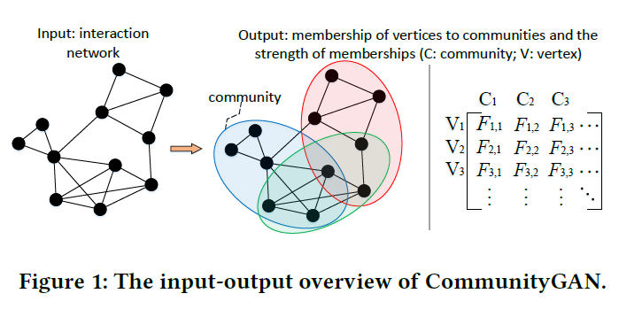
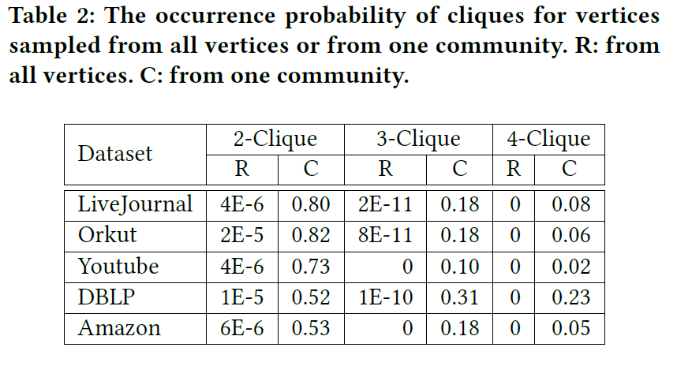
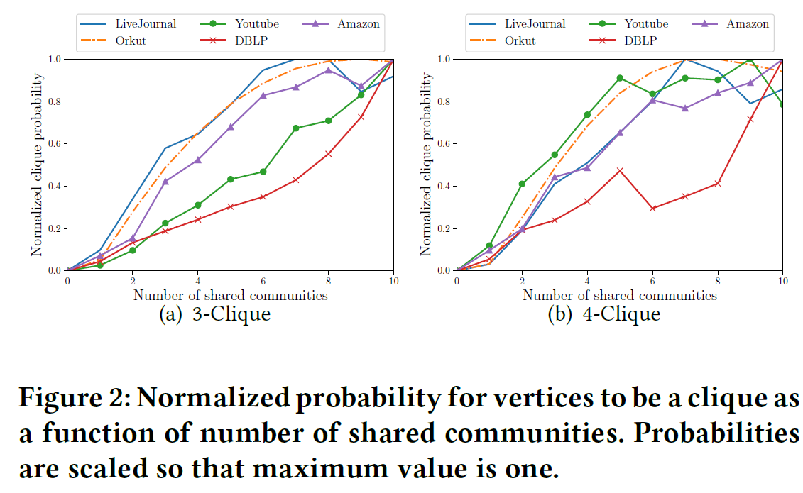
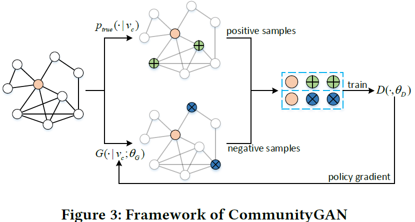
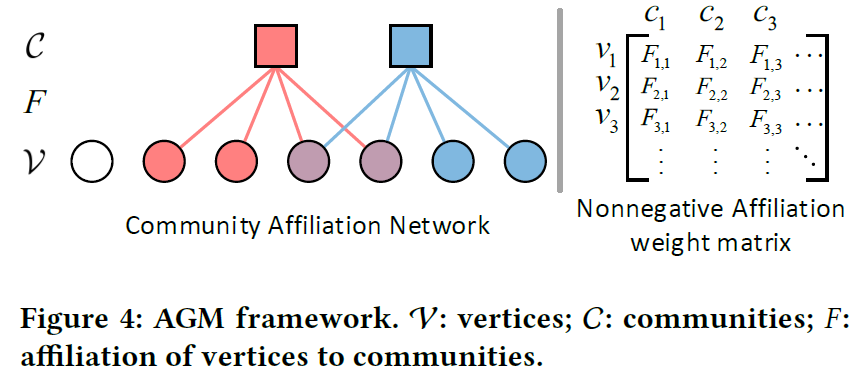
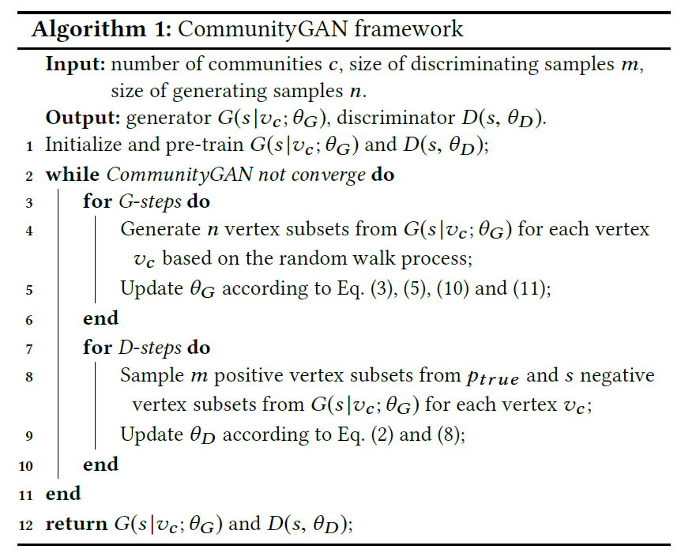
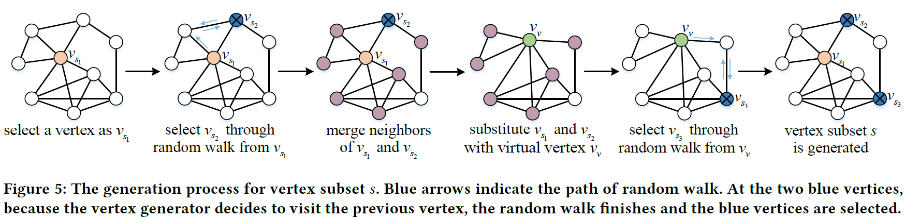
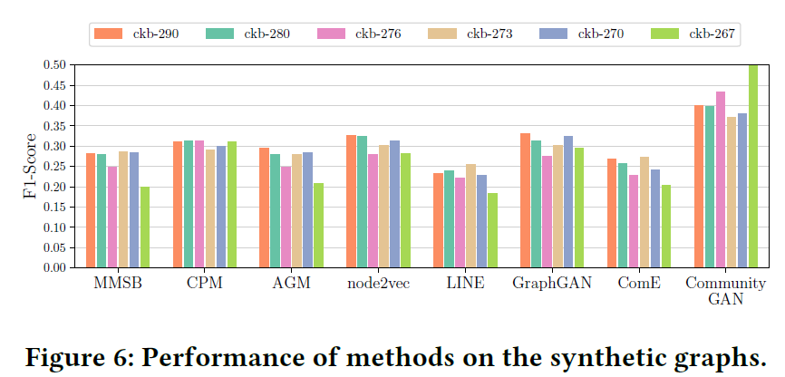
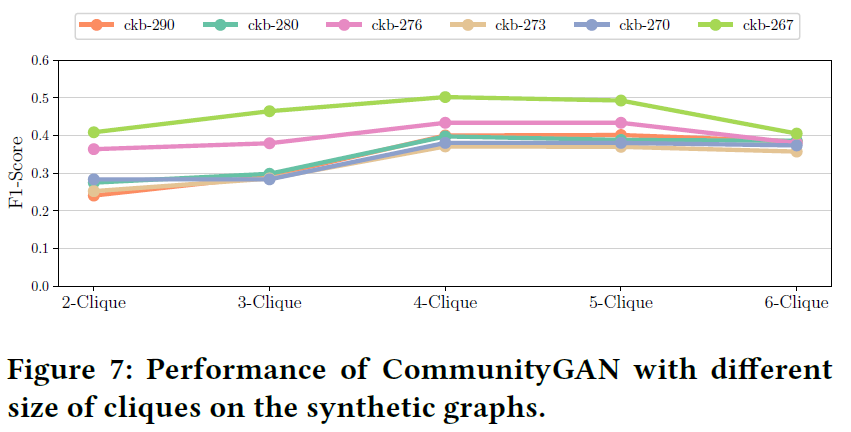
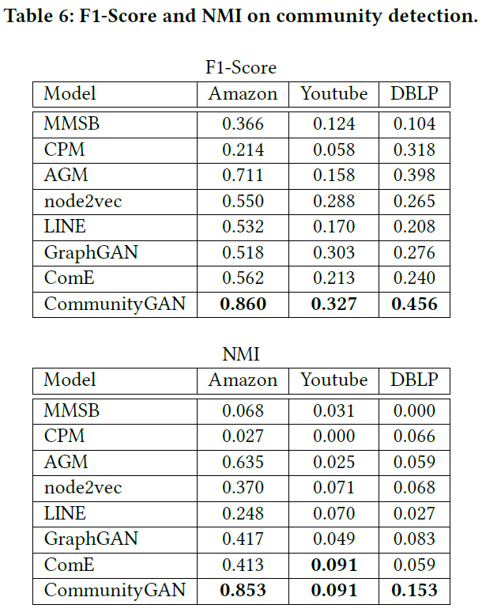

# 论文分享《CommunityGAN: Community Detection with Generative Adversarial Nets》

> 论文链接：https://arxiv.org/pdf/1901.06631
>
> 论文会议：The World Wide Web Conference, 2019

## 1. Abstract

### 1.1 What do they do

通过真实数据集上的统计研究，验证了clique与community的强相关性，并基于GAN思路建模，结合AGM来同步完成**社区发现**和**节点表示学习任务**。

### 1.2 What's amazing points

- 将AGM中节点对的生成公式，扩展为clique的生成公式，并设计相应random walk，从motivation到建模实现较为清晰；
- 在合成数据集及真实数据的实验中，社区发现任务的结果较为理想。

### 1.3 Learning model

- GAN based
- unsupervised learning
- overlapped community detection 
- non-attributed graph

## 2. Motivation

1. 当前缺少对重叠社区发现任务的建模；

2. 数据分析发现，团和社区结构常同时出现。具体分析如下：

   - 在分别在全图及社区中抽样2/3/4个节点，统计节点能组成团clique的概率，结果如下：

     

   - 统计“节点集同属社区的个数-节点集形成团”间的关系，结果如下：

     表明**节点集共享社区越多，越有可能形成团**。

     > 此前**AGM**中节点对与共享社区关系的数据分析，可以理解为2-Clique，而本文则进一步研究3,4-Clique与共享社区的关系。

     

     综上所属，团与社区结构密切相关。

## 3. Model

### 3.1 Framework

基于GAN建模，生成器G和判别器D迭代学习（此处引入强化学习中常用的*policy gradient*来训练）。

其中，

- G用于生成最像clique的节点子集（也可理解为从图中抽取节点子集，并且该子集尽可能像clique）。
- D则判别上述节点子集是否在图中为clique

上述目标形式化表示为：
$$
\begin{array}{l}
\min _{\theta_{G}} \max _{\theta_{D}} V(G, D)=\sum_{c=1}^{V}\left(\mathbb{E}_{m \sim p_{\text {true}}}\left(\cdot \mid v_{c}\right)\left[\log D\left(m ; \theta_{D}\right)\right]\right. \\
\left.\quad+\mathbb{E}_{s \sim G\left(s \mid v_{c} ; \theta_{G}\right)}\left[\log \left(1-D\left(s ; \theta_{D}\right)\right)\right]\right)
\end{array}
$$

> 乍一看此时还未和社区发现、图表示学习产生关联，切莫着急，作者按顺序慢慢推导建模。

### 3.2 A Naive Implementation of D and G

- 判别器**D**：连乘经过sigmoid函数后的节点向量内积

$$
D(s)=\prod_{(u, v) \in s, u \neq v} \sigma\left(\mathrm{d}_{u}^{\top} \cdot \mathrm{d}_{v}\right)
$$

- 生成器**G**：

$$
\begin{aligned}
& G\left(s \mid v_{c}\right) \\
=& G_{v}\left(v_{s_{2}} \mid v_{s_{1}}\right) G_{v}\left(v_{s_{3}} \mid v_{s_{1}}, v_{s_{2}}\right) \cdots G_{v}\left(v_{s_{m}} \mid v_{s_{1}}, \ldots, v_{s_{m-1}}\right)
\end{aligned}
$$

基于此前采的节点集${v_{s_1},...,v_{s_{m-1}}}$,来生成$v_{s_m}$，最后得到生成的节点子集。

最直接的方法，通过softmax来完成上述采样计算：
$$
G_{v}\left(v_{s_{m}} \mid v_{s_{1}}, \ldots, v_{s_{m-1}}\right)=\frac{\exp \left(\sum_{i=1}^{m-1} \mathbf{g}_{v_{s_{m}}}^{\top} \mathbf{g} v_{s_{i}}\right)}{\sum_{v \notin\left(v_{s_{1}}, \ldots, v_{s_{m-1}}\right)} \exp \left(\sum_{i=1}^{m-1} \mathbf{g}_{v}^{\top} \mathbf{g}_{v_{s_{i}}}\right)}
$$

### 3.3 CommunityGAN

上述实现有如下缺陷：

- 未能实现社区发现
-  softmax计算开销大
-  softmax忽略图结构信息

为此，引入**AGM**进行建模，**AGM**基本示意图如下：

> [AGM论文笔记](https://zhuanlan.zhihu.com/p/331754085)
>
> 用一个非负矩阵$F$描述每个节点与社区的隶属关系，每行表示该行对应节点属于各个社区的概率。
>
> 有了$F$后，生成新图$G'$，对于节点对$u,v$间是否有边，依照如下公式计算概率
> $$
> p(u, v)=1-\exp \left(-F_{u}^{\top} \cdot F_{v}\right)
> $$

将上式扩展为“对于节点集$v_{1,...m}$，能形成clique的概率”：
$$
\begin{aligned}
p\left(v_{1}, v_{2}, \ldots, v_{m}\right) &=1-\prod_{c}\left(1-p_{c}\left(v_{1}, v_{2}, \ldots, v_{m}\right)\right) \\
&=1-\exp \left(-\odot\left(F_{v_{1}}, F_{v_{2}}, \ldots, F_{v_{m}}\right)\right)
\end{aligned}
$$
自然而然，我们可以用上式作为判别器D，即
$$
D(s)=1-\exp \left(-\odot\left(\mathrm{d}_{v_{1}}, \mathrm{~d}_{v_{2}}, \ldots, \mathrm{d}_{v_{m}}\right)\right)
$$
生成器G中每个节点的采样也可基于上式，使用softmax计算采样概率：
$$
\begin{array}{l}
G_{v}\left(v_{s_{m}} \mid v_{s_{1}}, \ldots, v_{s_{m-1}}\right) \\
=\frac{1-\exp \left(-\odot\left(\mathrm{g} v_{s_{1}}, \ldots, \mathrm{g}_{v_{s_{m}}}\right)\right)}{\sum_{v \notin\left(v_{s_{1}}, \ldots, v_{s_{m-1}}\right)} 1-\exp \left(-\odot\left(\mathrm{g}_{v_{s_{1}}}, \ldots, \mathrm{g}_{v_{s_{m-1}}}, \mathrm{~g}_{v}\right)\right)}
\end{array}
$$
具体采样则通过random walk实现。

模型算法如下：

算法中的$\theta_{G,D}$即为**AGM**模型中的非负矩阵$F$，用以完成社区发现。

**实现细节**：

- 矩阵$\theta$文章给出两种初始化方式（延用前人模型方法），分别为(1) 训练AGM模型；(2) locally minimal neighborhoods 算法；

- 为了让**G**能采样出最像clique的节点子集，本文设计了如下random walk：

  

## 4. Experiments

### 4.1 合成数据集

作者希望通过实验证明：

- CommunityGAN能有效在社区重叠稠密的图上完成社区发现工作
- motif-level生成与判别的能力

基于*Distributed Generation of Billion-node Social Graphs with Overlapping Community Structure*工作生成如下合成图：

> 可见合成的图社区重叠率都很高。

实验结果如下：

### 4.2 真实数据集

实验结果如下:

## 5. Thoughts

- Cliques与社区结构常常共同出现不假，但非社区结构的必要特征，还是要看数据集的真实分布情况。可能模型对部分数据集的拟合能力较差。
- 文章有点tricky的描述：模型学得了有解释意义的节点embedding，每个维度代表属于对应社区的强度。但事实上，模型所谓的embedding即是AGM模型中的矩阵$F$。如此一来，embedding维度受限与社区个数，而非任意取值了。
- 作为建模工作的副产物，本文似乎为图数据挖掘中clique挖掘带来了新思路。