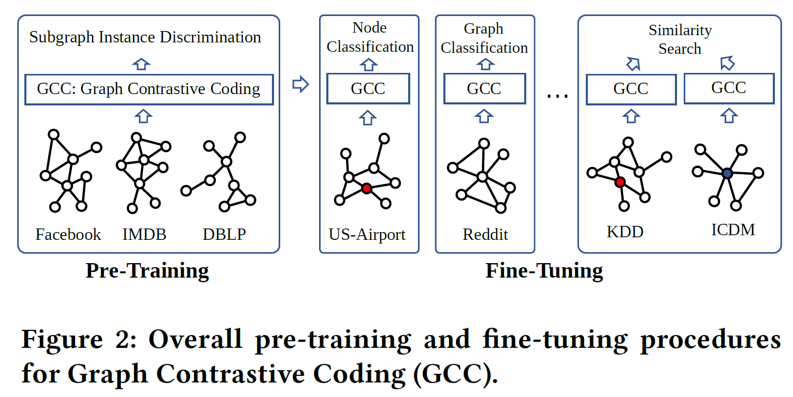
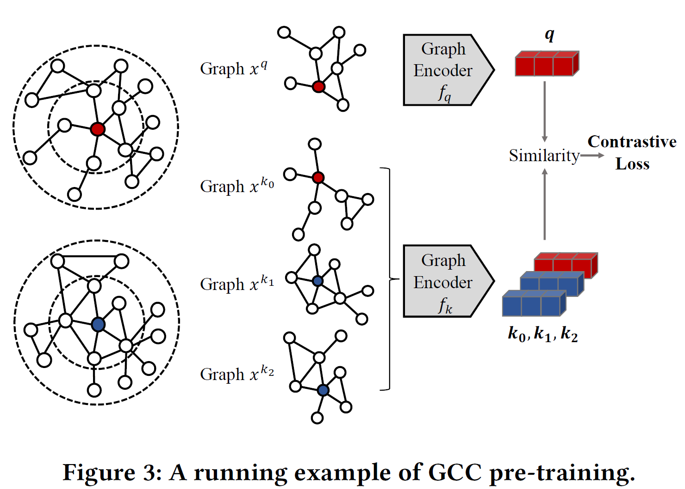
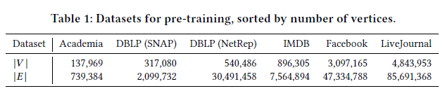
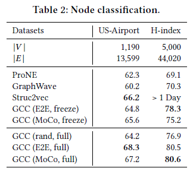
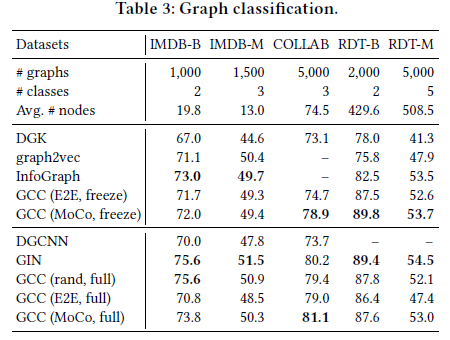
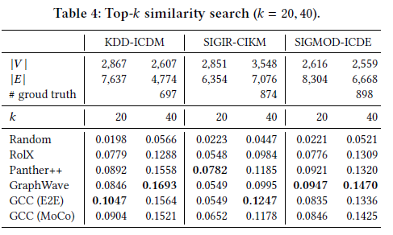

# 论文分享《GCC: Graph Contrastive Coding for Graph Neural Network Pre-Training》

> 论文链接：http://keg.cs.tsinghua.edu.cn/jietang/publications/KDD20-Qiu-et-al-GCC-GNN-pretrain.pdf
>
> 论文会议：KDD2020
>
> 论文代码：https://github.com/THUDM/GCC

写在前面：刚刚开始了解*self-supervised learning*，本篇工作也有许多前人做了优秀的总结，此篇分享仅作个人阅读记录用，也请各位指出我理解的错漏。

## 1. Abstract

### 1.1 What do they do

基于自监督对比学习提出图跨领域(cross-domain)的预训练模型，尝试学习并迁移图结构信息。具体的，通过Random Walk with Restart在每个节点的r-ego network上导出子图，得到正负例，基于MoCo范式进行模型预训练。

### 1.2 What's amazing points

- 设计r-ego子图及其预训练任务，尝试捕获可跨领域迁移的structural patterns；
- 实验表明预训练模型在不同数据集及任务上，经过fine-tuning后可达comparative results。

### 1.3 Learning model

- graph: graph without node attributes and node labels
- self-supervised learning
- GNN model: GIN

## 2. Motivation

- 目前较少在图上做跨领域预训练的模型;
- 基于如下假设“代表性的图结构模式是通用的并且可以跨网络转移(**Representative graph structural patterns are universal and transferable across networks.**)”，希望设计预训练模型，习得可迁移的graph embedding。

## 3. Model

### 3.1 The GNN Pre-Training Problem

- 目标：在不同数据集上预训练得到一个函数$f$，能将节点映射为低维向量，这个函数能用于新的数据集。
- 函数$f$的性质：
  - 结构相似性 structural similarity
  - 可迁移性 transferability

### 3.2 GCC Pre-Training

基于Contrastive Learning对比学习范式，本工作将*subgraph instance discrimination*作为预训练任务，*InfoNCE*作为学习目标，有
$$
\mathcal{L}=-\log \frac{\exp \left(q^{\top} \boldsymbol{k}_{+} / \tau\right)}{\sum_{i=0}^{K} \exp \left(q^{\top} \boldsymbol{k}_{i} / \tau\right)}
$$

其中，$q=f_{q}\left(x^{q}\right)$，$k=f_{k}\left(x^{k}\right)$，$f$为图神经网络，将实例$x$映射为向量表示，$\tau$为超参。

对比学习希望给定实例(instance)$q$，能得到与之最相似的实例$k_{+}$。

> 感谢@[Tobias Lee](https://www.zhihu.com/people/ju-cheng-37)的👉[对比学习简介笔记](https://tobiaslee.top/2020/05/18/contrastive-learning-notes/)

如上所述，有3个问题需要解决：

1. 如何定义图中的子图实例？
2. 实例间的相似度如何评估？
3. 选用什么encoder？

**1. 设计图中的实例**

为了学习节点的结构信息，选择节点临近的子图作为实例。此工作使用*r-ego network*。即由节点$v$及其$≤r$阶的邻居组成的子图。

**2. 定义实例相似度**

由CV中数据扩增技术启发，此工作通过如下三步获取相似实例：

	1.  给定节点$v$，由其出发进行带重启的随机游走Random walk with restart；
	2.  随机游走所得节点集，导出它们对应的r-ego子图；
	3.  匿名化，将子图节点下标重排为{1,2,……}

匿名化目的：

1. 防止模型仅学到“通过比较vertex id来判别相似度”
2. 使模型具备泛化能力 ( 由于 GNN are invariant to permutations)

**3. encoder选择**

本工作选用**GIN**作为编码器。

由于此工作研究的图无特征，此工作提出*Generalized positional embedding*，使用normalized graph Laplacian的特征向量作为attribute matrix。

## 4. 实验

1. 硬件：an Intel(R) Xeon(R) CPU E5-2680 v4 @ 2.40GHz, 256GB RAM and 8 NVIDIA 2080Ti GPUs

2. 预训练数据集

   

3. 实验结果

   

   

   

   从结果可以观察

   - node classification中，预训练模型展现了喜人的可迁移能力；
   - 其他任务中，GCC也与SOTA模型表现相近。

总得来说，预训练完成后的GCC，一方面可以视作图神经网络的初始化参数，另一方面也可以作为强大的节点特征提取器。

其他：

@[十四楼的残魂](https://www.zhihu.com/people/shi-si-lou-de-can-hun-83) 对图上的对比学习做了高屋建瓴的总结，推荐阅读！[论文阅读｜浅谈图上的自监督学习——对比学习](https://zhuanlan.zhihu.com/p/187247235)

