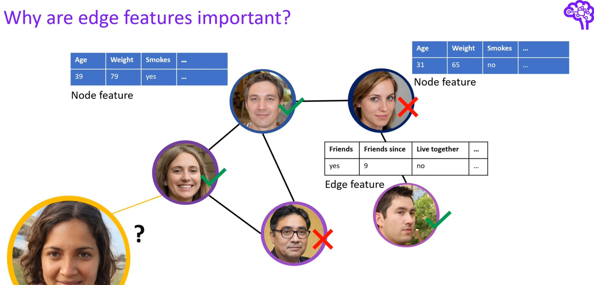
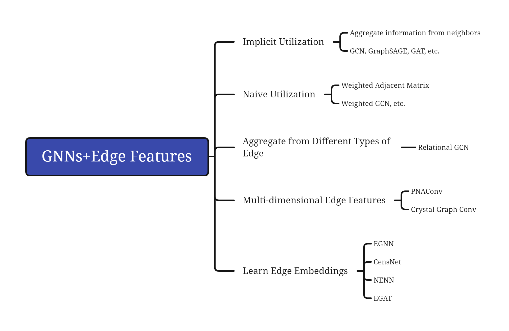
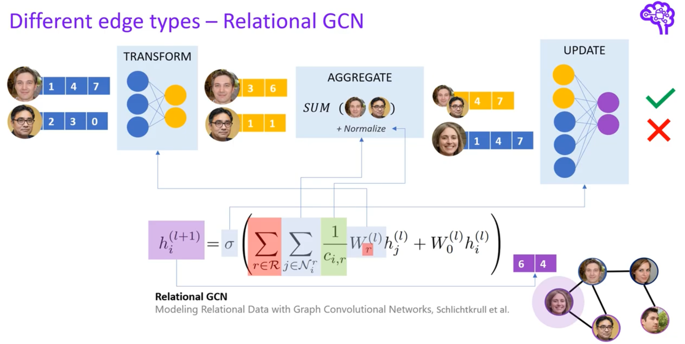
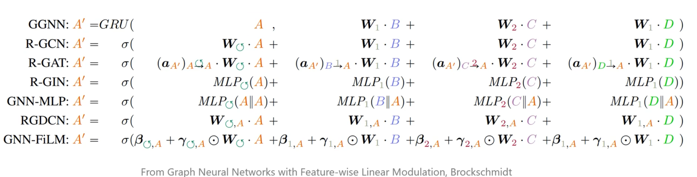
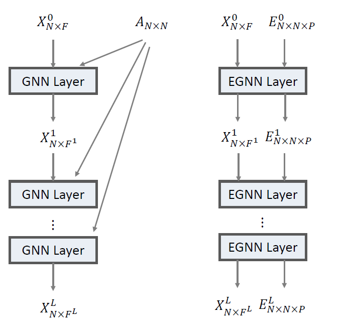
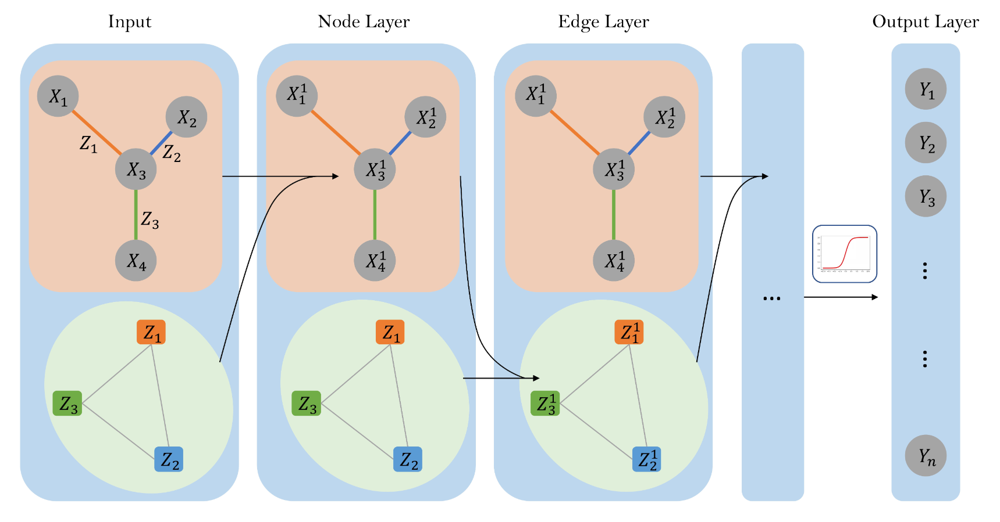
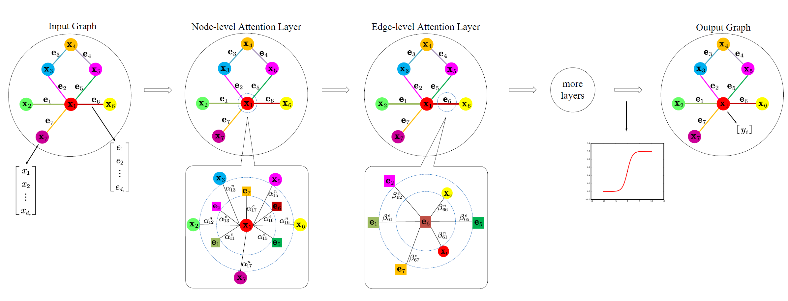
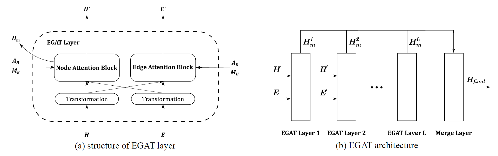

# GNN 利用边信息

> **Abstract**:
>
> 当前GNNs主要利用了节点特征，忽略了边上信息。本笔记对GNNs中利用边信息的方式进行小结。

<!--more-->

部分图片截取自[1]，感谢原创人员悉心的总结分享。

## 1. Backgrounds

图表示学习近年来取得巨大进展，以**GCNs**为代表的一系列图神经网络模型在节点分类、图分类、链接预测等图领域任务取得亮眼的成果。其中大部分模型基于*message-passing*方式构建，即“聚合邻居信息，更新节点自身状态”，在此范式中，节点特征得到充分的学习。而现实的许多图中，边上存在丰富的信息，它们在当前大多模型中未被充分利用。

Edge Features同样描述着网络，学习edge features能强化图神经网络的表达能力。

以下图为例：

社交网络中，edge features更具体地描述着用户(nodes)间关系。

## 2. Recently Works

当前图神经网络对边信息主要有如下几种利用方式：

### 2.1 Implicit Utilization

每个节点只aggregate其邻居的信息，这一聚合方式本身就基于节点间的边实现。此情况下只视作各个边为binary feature，只有“有边/无边”区别。

### 2.2 Naive Utilization
对于边上特征为scalar的情况，最简单直接的方式是使用带权的邻接矩阵描述，与之对应的，使用支持edge weight的模型学习即可。

### 2.3 Aggregate from Different Types of Edge

在许多场景中，边上特征为类别标签，如社交网络中，边上可以标注两人为工作关系、家人等。

对于存在多种类型边的图（边异构），常见处理方法是**依照边的类型分别聚合信息**。

如早期工作**Relational GCN**[2]，

其只在GCN

$$h^{l+1}_i = \sum_{j \in \mathcal{N}_{i}} \frac{1}{norm} W^{(l)} h_{j}^{(l)}+W^{(l)} h_{i}^{(l)}$$

的基础上，增加了$\sum_{r \in R}$.

其他模型也是类似思路，仅在聚合方式上做进一步细化。
如下图：

### 2.4 Multi-dimensional Edge Features

上述3个方式并不能较好地处理边上多维特征。面对多维边特征，常见手段也是在aggregation阶段将边特征、邻居节点特征通过某种function结合在一起，再传给目标节点。

General Idea 如下图：

相关工作有*PNAConv*[3],*Crystal Graph Conv*[4]。

### 2.5 Learn Edge Embeddings

与2.4区别在于，下述方法以多维边特征为输入，并在模型每层更新，类似学习node embedding一般，同时学习edge embeddings。其实现方式多为创建某种辅助图，在该图中将边也视作节点，再用现有GAT等模型学习边和节点的表示。

1. *EGNN* [5]
   $$
   X^{l}=\sigma\left[\prod_{p=1}^{P}\left(\alpha_{\cdots p}^{l}\left(X^{l-1}, E_{\cdots p}^{l-1}\right) g^{l}\left(X^{l-1}\right)\right)\right]
   $$

   $P$ 为边特征维度数。
   
   在GAT基础上，单独处理每一维的特征。聚合函数中加入节点特征，并为每一维特征单独学一组注意力权重，最后将各维输出concate。本文的edge embeddings，为每层所学的边多维特征注意力权重。
   
   
   
2. *CensNet* [6]

   使用line graph（原始图中节点变为line graph中的边，边变为节点）构建辅助图，在original graph和line graph上训练模型，交替更新node, edge embeddings。

   

3. *NENN* [7]

   以GAT为基础，提出Node-level Attention Layer, Edge-level Attention Layer。

   每个layer区别主要在于输入的图的观察角度。

   如下图中两矩形方框部分，分别以node、edge为视角，重新定义“邻居”，将边/节点视作新图中的节点，在新图中学习边和节点的embeddings。

   

4. *EGAT* [8]

   与*CensNet*类似，使用line graph+GAT学习节点和边的表示。

   

## 3. Discussion

1. 2.5中多用GAT编码边特征信息，带来较大的计算开销，能否更轻量且优雅的编码边特征？
2. 2.5中使用诸如line graph等构建辅助图，把原图中的边变换为辅助图中的节点，从而可以利用已有GNN进行边嵌入的学习。但是，对于“边的邻居边”，是否同样满足节点与其邻居相近的假设？
3. 如何评估边特征与节点的关系，边特征如何切实的帮助图表示学习？

## Reference

1. https://www.youtube.com/watch?v=mdWQYYapvR8
2. Schlichtkrull M, Kipf T N, Bloem P, et al. Modeling relational data with graph convolutional networks[C]//European semantic web conference. Springer, Cham, 2018: 593-607.
3. Corso G, Cavalleri L, Beaini D, et al. Principal neighbourhood aggregation for graph nets[J]. arXiv preprint arXiv:2004.05718, 2020.
4. Xie T, Grossman J C. Crystal graph convolutional neural networks for an accurate and interpretable prediction of material properties[J]. Physical review letters, 2018, 120(14): 145301.
5. Gong L, Cheng Q. Exploiting edge features for graph neural networks[C]//Proceedings of the IEEE/CVF Conference on Computer Vision and Pattern Recognition. 2019: 9211-9219.
5. Jiang X, Ji P, Li S. CensNet: Convolution with Edge-Node Switching in Graph Neural Networks[C]//IJCAI. 2019: 2656-2662.
5. Yang Y, Li D. Nenn: Incorporate node and edge features in graph neural networks[C]//Asian Conference on Machine Learning. PMLR, 2020: 593-608.
5. Chen J, Chen H. Edge-Featured Graph Attention Network[J]. arXiv preprint arXiv:2101.07671, 2021.
