# 论文笔记： Improving Graph Neural Networks with Structural Adaptive Receptive Fields

> PDF: https://dl.acm.org/doi/10.1145/3442381.3449896
>
> Conferences: WWW '21

## 1. Abstract

现有GNN模型未能充分利用图结构信息，此工作提出STructural Adaptive Receptive fields (**STAR-GNN**)，适应性地构建每个节点的感受野(receptive field)以捕获结构信息。具体贡献如下：

- 提出基于节点结构信息来自适应调节receptive field范围STAR-GNN；
- 将Anonymous Random Walks (ARWs)和互信息结合来捕获节点的结构信息，此外还提出针对receptive field的subgraph 聚合算子。

## 2. Motivations

**大部分GNNs未能充分利用图结构信息，对邻居节点的重要性没有区分：**

- 传统的GCN将邻居节点一视同仁，或者根据边权来分配权重，因而忽略了许多与邻居重要性有关的信息；
- GAT使用soft attention，基于节点特征的相似度来学习权重，但其，① 忽略拓扑特征的相似度信息，② soft attention在邻居数量较大时可能遭遇过平滑问题。

对此，希望能提出一种**结合结构信息来适应性地构建节点receptive field**的方法，该方法希望能 ①同时根据节点特征和结构特征来衡量邻居重要性，② receptive field聚合irregular neighborhoods 且避免过平滑问题。

遇到的挑战如下：

1. 图复杂的结构信息难捕获；
2. 适应性地构建receptive field计算复杂度高。该adaptive构建过程是不可微的，因而难直接优化。此前使用强化学习及组合优化的方式计算复杂度都过高；
3. 不能基于k-order邻居来建立receptive field。理想的receptive field是不规则的子图，可能有数量各异的各阶邻居，现有聚合算子难有效聚合这样的子图结构。

## 3. Method

### 3.1 Overview

STAR-GNN主要分为3个部分：

1. **Local Structural Distribution**，使用ARWs来捕获节点的邻居分布，结合Mutual Information(MI)来计算注意力，得到包含节点特征和结构信息的structural embedding；*(ARWs对邻居结构的描述是好的吗？通过random walk使其具备泛化性，但ARWs的编码是否损失直观的信息？我们也可以引入RW-subgraph来补足一点泛化性。MI的引入值得思考)*
2. **Construction of Optimal Receptive Fields**，用structural embedding计算节点对间MI，贪心地寻找optima receptive field；*（不在聚合阶段做筛选，将receptive field的构建前置，减少噪音）*
3. **GNN with Sub-graph Structures**，通过采样不规则subgraph（receptive field）中节点，进行聚合。*（符合个人此前实现子图聚合的想法，提供了理论证明）*

### 3.2 Neighborhood Contributions Local Structural Distribution

Attention score 计算，过往一些方法基于节点特征相似度，一些则引入了人为设计的结构信息patterns，都只能捕获有限结构信息且泛化性不佳。

本工作则使用ARWs刻画节点的邻居结构特征，认为ARWs能较好地描述节点的local structural distribution。ARWs定义如下：

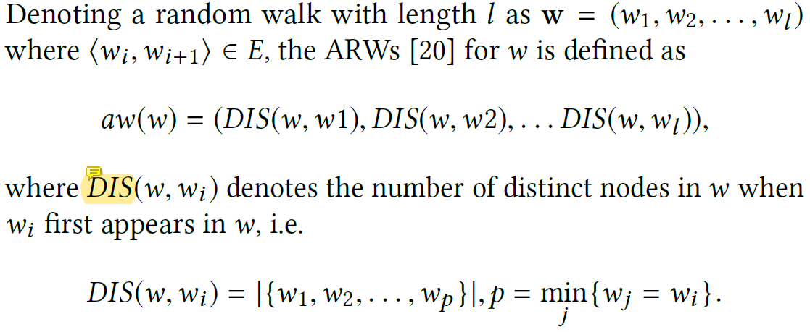

进一步地，本工作引入互信息(MI)来辅助学习节点embedding $U={u_i}$，希望最大化节点对间特征、结构信息。Loss设计有：

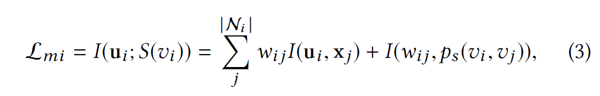

其中$w_{i j}=\sigma\left(\mathbf{u}_{i}^{T} \mathbf{u}_{j}\right)$，$\mathcal{N}_{i}$为节点$i$的ARWs中所访问到的节点集合，$I(·, ·)$为互信息，第一项衡量节点间特征相似度，第二项衡量结构相似度。

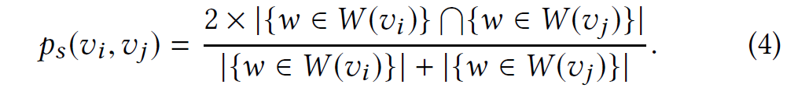

Attention score则由上述$u$计算，

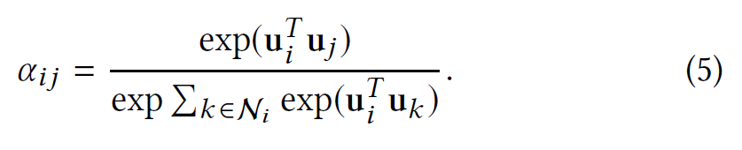

### 3.3 Construction of Optimal Receptive Fields

作者先前的工作说明GAT中的soft attention，在节点度较高时会遇到过平滑问题。因而构建receptive field时，应当“construct discrete adaptive receptive fields to avoid over-smoothing”(不是很理解，是否理解为需要筛选邻居，以减少聚合对象个数)。

作者认为，理想的receptive field应当**为中心节点提供最多的信息**，并希望用**MI**来衡量获取信息的多少。

因为MI≥0，故receptive field增大时MI和单调不减，故本工作将优化目标定为：以最小的receptive field取得满足阈值的MI：

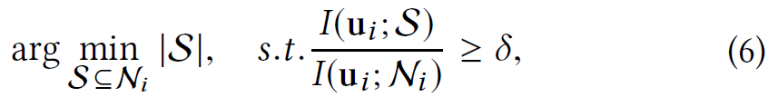

本工作使用贪心算法求解上述优化问题。

### 3.4 GNN with Sub-graph Structures

当前聚合算子如Mean, Max, LSTM针对k-hop邻居做聚合，对于不规则的subgraph，聚合时难以区分不同阶邻居信息。

本工作对如下聚合方式进行一系列证明，说明其满足permutation invariant。最后得到的聚合方式为：

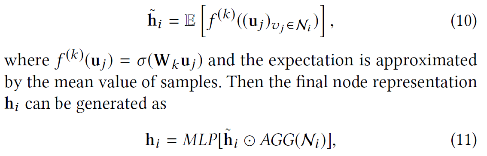

模型loss则为

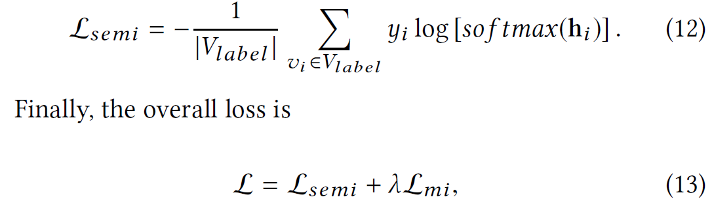

模型算法描述如下：

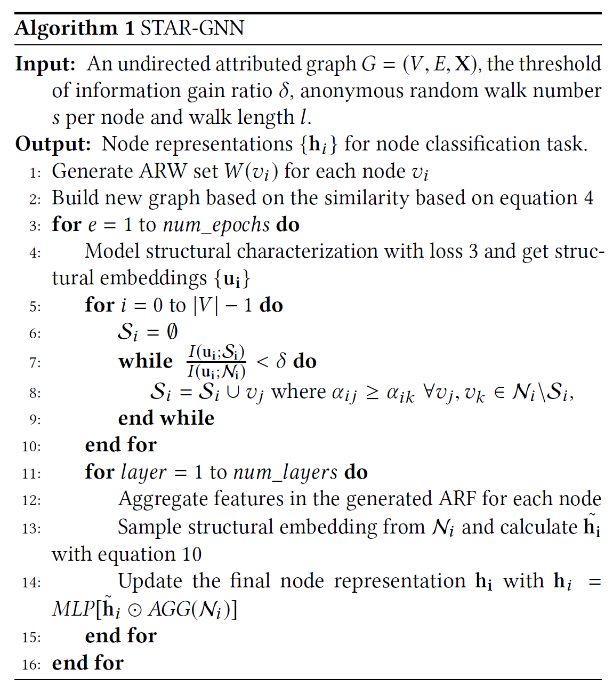

## 4. Exp

1. 节点分类

   - Transductive
   - 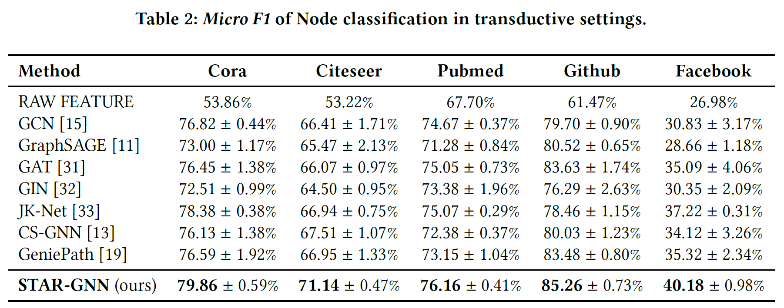
   - Inductive
   - 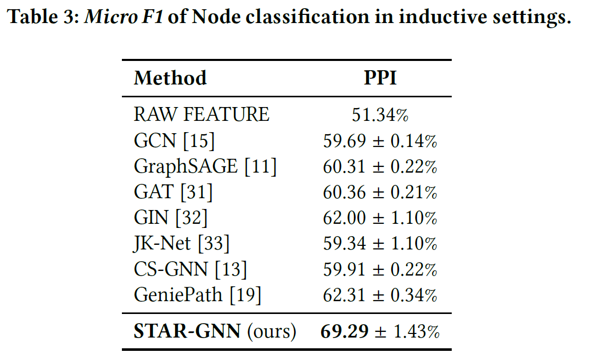

2. Ablation study

   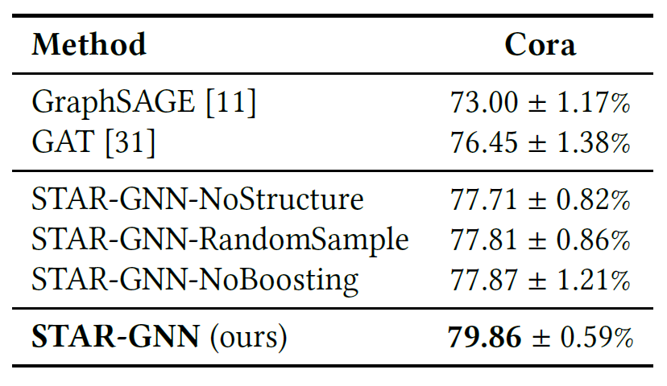

   相对而言，引入结构信息和选择optimal receptive field对性能帮助更大。

   
