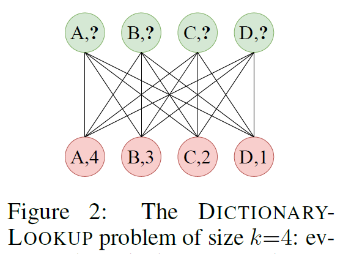
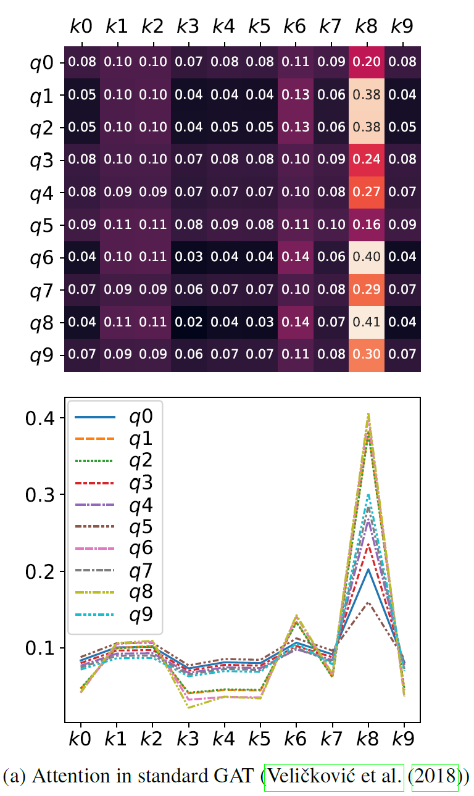
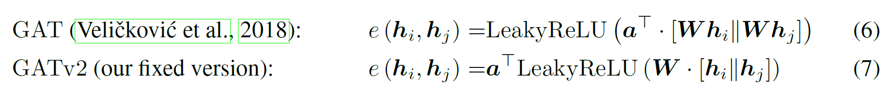
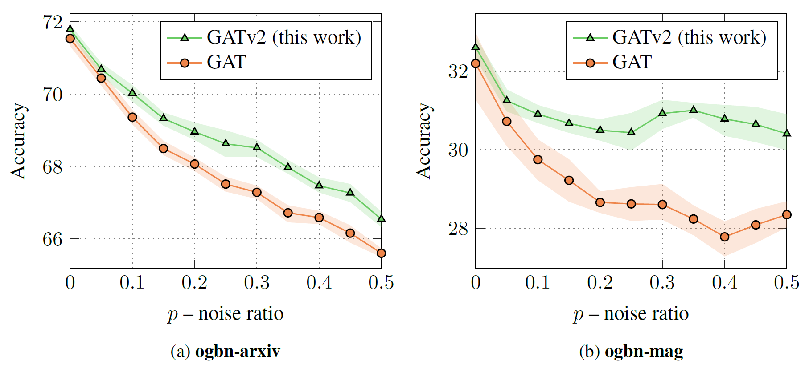
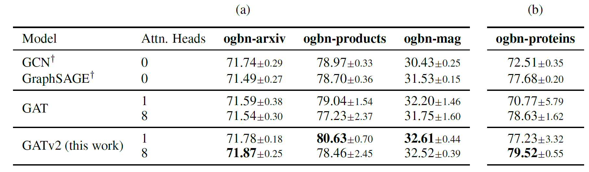
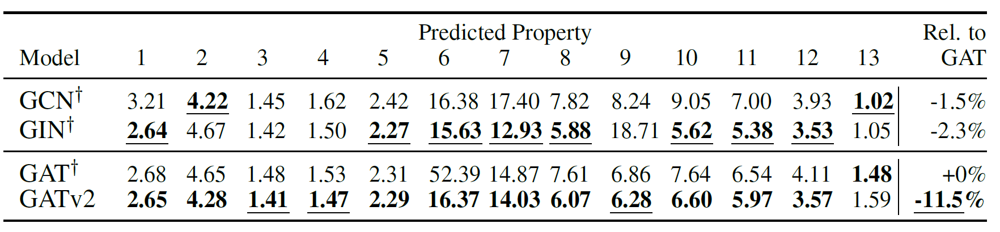
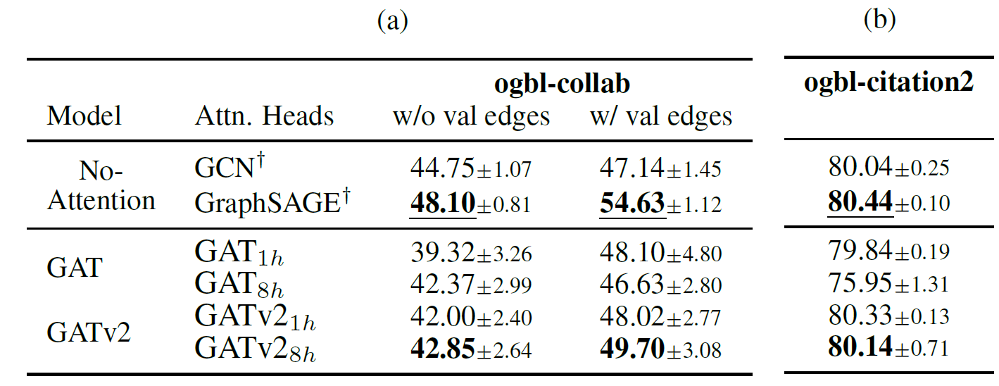
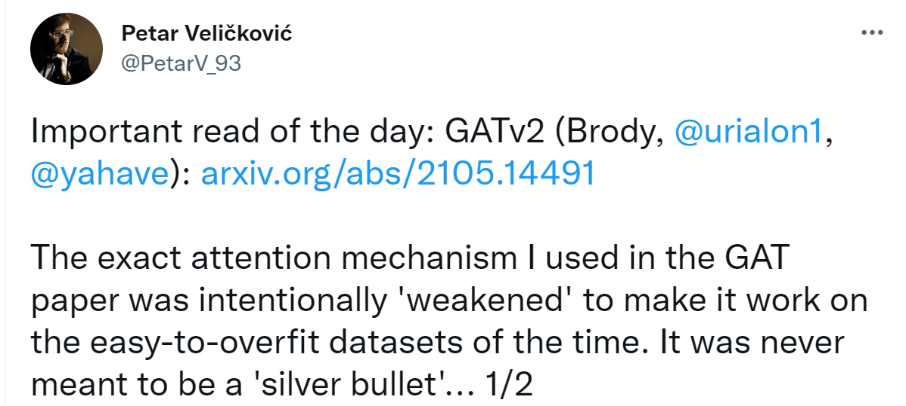
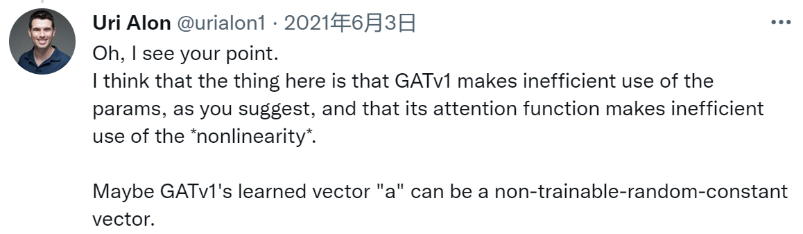
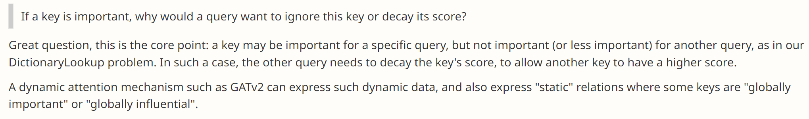

# 论文笔记：HOW ATTENTIVE ARE GRAPH ATTENTION NETWORKS?

> PDF: https://openreview.net/pdf?id=F72ximsx7C1
>
> OpenReview：https://openreview.net/forum?id=F72ximsx7C1
>
> ICLR 2022

## 1. Abstract

认为GAT是static attention，仅实现了对节点重要度的静态ranking，而未实现对不同query给出不同key的设想；提出GATv2，通过调整LeakyReLU和linear unit计算顺序，实现dynamic attention，即对不同query能给出不同key。

## 2. Motivations

GAT已成为图神经网络发展历程中的标志性架构，但本文观察发现，GAT的attention对于相同的keys实现的其实是ranking。

假设有如下二部图，求解 *Dictionary Lookup* 问题：

使用GAT所得的attention scores如下：

可以看到，对于不同的query，key的scores排序实际是一样的（**静态**的）。这限制了GAT的表达能力。

而本文认为，attention的初衷应该是：给定不同的query，能找到不同的key（即不同query，ranking结果应该不同，**动态**的）。

## 3. Method

### 3.1 Definitions

注意力机制其实是求解给定query时keys的注意力得分分布。

- **Static Attention**

  设有计算注意力得分的函数族$\mathcal{F}$,  对于任意 $f \in \mathcal{F}$，给出 key $\mathbb{K}=\left\{\boldsymbol{k}_{1}, \ldots, \boldsymbol{k}_{n}\right\} \subset \mathbb{R}^{d}$ 和 query $\mathbb{Q}=\left\{\boldsymbol{q}_{1}, \ldots, \boldsymbol{q}_{m}\right\} \subset \mathbb{R}^{d}$，若存在一个“得分最高”的 key $k_{j_f}$ 使得 $f\left(\boldsymbol{q}_{i}, \boldsymbol{k}_{j_{f}}\right) \geq f\left(\boldsymbol{q}_{i}, \boldsymbol{k}_{j}\right)$，则称 $\mathcal{F}$ 为静态注意力；

- **Dynamic Attention**

  设有计算注意力得分的函数族$\mathcal{F}$, $f \in \mathcal{F}$，给出 key $\mathbb{K}=\left\{\boldsymbol{k}_{1}, \ldots, \boldsymbol{k}_{n}\right\} \subset \mathbb{R}^{d}$ 和 query $\mathbb{Q}=\left\{\boldsymbol{q}_{1}, \ldots, \boldsymbol{q}_{m}\right\} \subset \mathbb{R}^{d}$，对于任意的映射 $\varphi:[m] \rightarrow[n]$，存在  $f \in \mathcal{F}$，使任意的 query 及任意的 key  $j_{\neq \varphi(i)} \in[n]$，有$f\left(\boldsymbol{q}_{i}, \boldsymbol{k}_{\varphi(i)}\right)>f\left(\boldsymbol{q}_{i}, \boldsymbol{k}_{j}\right)$，则称 $\mathcal{F}$ 为动态注意力。

### 3.2 GAT有限的表达能力及修正

- **GAT 分析**

  首先回顾GAT中attention score计算方式，有：
  $$
  e\left(\boldsymbol{h}_{i}, \boldsymbol{h}_{j}\right)=\text { LeakyReLU }\left(\boldsymbol{a}^{\top} \cdot\left[\boldsymbol{W} \boldsymbol{h}_{i} \| \boldsymbol{W} \boldsymbol{h}_{j}\right]\right)
  $$

  $$
  \alpha_{i j}=\operatorname{softmax}_{j}\left(e\left(\boldsymbol{h}_{i}, \boldsymbol{h}_{j}\right)\right)=\frac{\exp \left(e\left(\boldsymbol{h}_{i}, \boldsymbol{h}_{j}\right)\right)}{\sum_{j^{\prime} \in \mathcal{N}_{i}} \exp \left(e\left(\boldsymbol{h}_{i}, \boldsymbol{h}_{j^{\prime}}\right)\right)}
  $$

  对于式子(1)，我们令 $\boldsymbol{a}=\left[\boldsymbol{a}_{1} \| \boldsymbol{a}_{2}\right] \in \mathbb{R}^{2 d^{\prime}}$，可得：
  $$
  e\left(\boldsymbol{h}_{i}, \boldsymbol{h}_{j}\right)=\text { LeakyReLU }\left(\boldsymbol{a}_{1}^{\top} \boldsymbol{W} \boldsymbol{h}_{i}+\boldsymbol{a}_{2}^{\top} \boldsymbol{W} \boldsymbol{h}_{j}\right)
  $$
  可以发现，对于有限的节点集合 $\mathcal{V}$，存在一个节点 $j_{max}$，使 $\boldsymbol{a}_{2}^{\top} \boldsymbol{W} \boldsymbol{h}_{j_{max}}$ 最大，即GAT计算的为 *static attention*。节点重要程度排序是确定的，和 query node 无关。Query node 只能影响注意力得分分布的 "sharpeness"。

  > 关于 **multi-head** ：上述结论对每个head仍适用，只是每个head的 $j_{max}$ 节点未必相同。

- **改进**

  本文核心内容，将 $\boldsymbol{a}$ 移动到非线性激活外，使GAT成为 *dynamic attention*。

  

  证明较长，见文章appendix。

## 4. Exp

-  *Dictionary Lookup* 

  对于上文中二部图问题，使用改进后的GAT能有效实现*dynamic attention*。

  

- Robustness to Noise

  本文发现*dynamic attention*能更好抵抗噪声（不过没有进一步分析原因）。

  

- Node / Graph / Link Prediction

  

  

  

  值得注意的是，节点预测中 单头的 GATv2 在两个数据集上有更佳表现。作者解释为单头的GATv2已经有足够的表达能力，使用8头时反而由于过强的表达能力，遭遇了过拟合。

## 其他

twitter和openreview上的讨论很有意思，截取一些在此。

- GAT原作者

  

- 关于GATv1, v2表达能力与参数数量的讨论 (二者参数数量相同，表达能力不同)

  

- 作者关于 *dynamic attention* 的思考

  