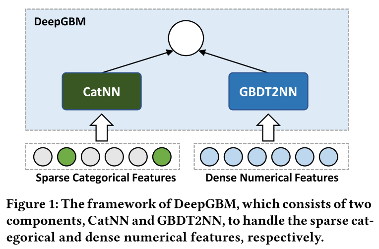
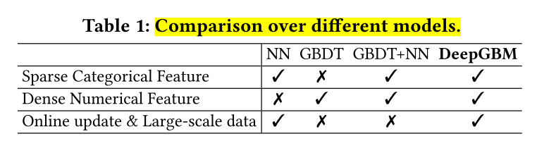
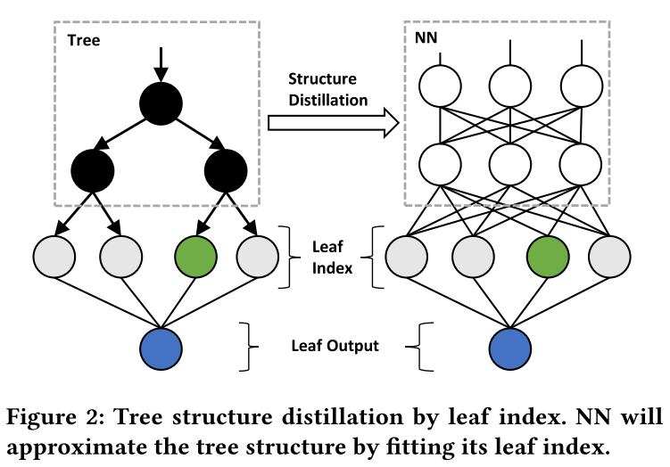
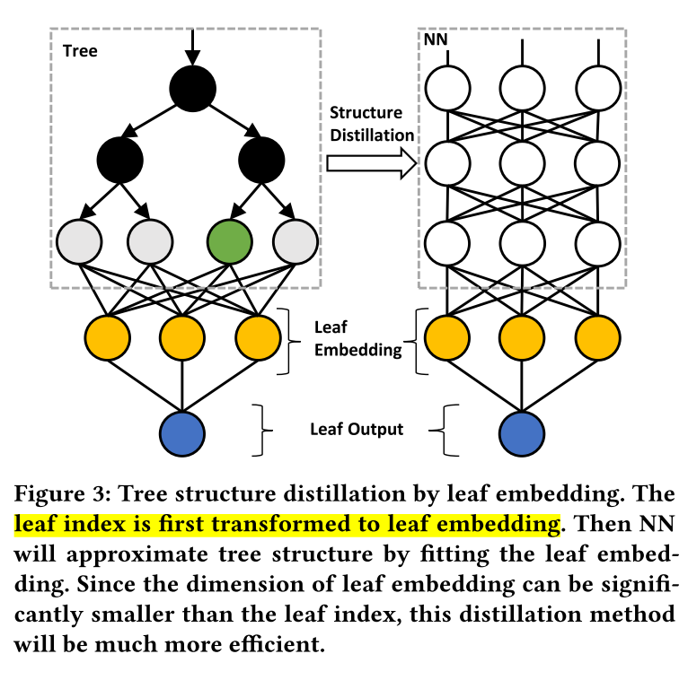

# DeepGBM: A Deep Learning Framework Distilled by GBDT for Online Prediction Tasks 阅读笔记

## 0. 本文信息

```
@inproceedings{ke2019deepgbm,
  title={DeepGBM: A Deep Learning Framework Distilled by GBDT for Online Prediction Tasks},
  author={Ke, Guolin and Xu, Zhenhui and Zhang, Jia and Bian, Jiang and Liu, Tie-Yan},
  booktitle={Proceedings of the 25th ACM SIGKDD International Conference on Knowledge Discovery \& Data Mining},
  pages={384--394},
  year={2019}
}
```


## 1. Contribution

1. 提出的DeepGBM模型结合了GBDT、NN的优势，能有效学习标签型、数值型特征，同时兼顾高效的在线更新能力。
2. 提出了将GBDT模型**蒸馏**为NN模型的方法。蒸馏时考虑树模型选择的特征子集，树的结构。



DeepGBM见上图，善用两个组件分别处理标签型、数值型特征。工作重点在GBDT2NN，介绍蒸馏方法。


## 2. Motivation

**在线预测任务的挑战**：

1. 模型如何有效学习*tabular input*（标签型、数值型特征兼具的输入）？
2. 模型如何适应在线的泛化、更新？


论文主要分析了GBDT、NN的优势和缺点。



- GBDT
  - 优势：高效处理密集的数值型特征(dense numerical features)。即通过信息增益来迅速长树的特性。
  - 缺点：
    - 学好的树不可微分，故无法在线更新。
    - 不擅长学习稀疏的标签型特征(sparse categorical features)。
- NN：
  - 优势：
    - 有效进行大数据+在线学习（依靠mini-batch + 反向传播）
    - 擅长学习稀疏的标签型特征(sparse categorical features)
  - 缺点：
    - 不擅长处理密集的数值型特征(dense numerical features)。容易过拟合，陷入复杂的超平面。


## 3. DeepGBM

### 3.1 CatNN

负责处理高维稀疏向量。

不重复造轮子，使用现有模型，如：Wide & Deep, PNN, DeepFM and xDeepFM.

### 3.2  GBDT2NN 处理数值密集型特征

#### 3.2.1 单树蒸馏

首先考虑使用**一个NN对GBDT中的一棵树**进行蒸馏学习。



过往树蒸馏模型，往往只要求新模型学习原模型的**输出** (即学习 input -> output 这映射)，然而树模型还有其他**性质**未被学习。

1. **特征选择** (Tree-Selected Features.)

   GBDT中不同树使用的特征不一定相同，为某一特征子集。故学习得的NN，也不必输入全部特征，而是使用该树的特征子集。

   用$\boldsymbol{x}\left[\mathbb{I}^{t}\right]$表示特征子集，$\mathbb{I}^{t}$为第t棵树使用的特征下标。

2. **树的结构**(Tree Structure)

   不再直接学习树输出的类别标签，而是学习对应**叶子节点的位置**。

   $\min _{\theta} \frac{1}{n} \sum_{i=1}^{n} \mathcal{L}^{\prime}\left(\mathcal{N}\left(\boldsymbol{x}^{i}\left[\mathbb{I}^{t}\right] ; \boldsymbol{\theta}\right), \boldsymbol{L}^{t, i}\right)$

   其中n是训练样本的数目, $x^i$是第i个训练样本，$L^{t, i}$是样本$x^i$的树$C^{t}\left(x^{i}\right)$叶子位置的独热(one-hot)表示，$\theta$是神经网络的模型参数，可以通过反向传播更新，$C^{t}\left(x^{i}\right)$是交叉熵之类的多分类问题的损失函数。

3. **树的输出**(Tree Outputs)

   对于一棵树的输出，只需要将one-hot向量点乘类别标签向量就得到预测的输出。

   $y^{t}(\boldsymbol{x})=\mathcal{N}\left(\boldsymbol{x}\left[\mathbb{I}^{t}\right] ; \boldsymbol{\theta}\right) \times \boldsymbol{q}^{t}$

#### 3.2.2 多树蒸馏



Intuitively，GBDT模型中的树可以通过*3.2.1*方式得到相同数量的NN模型，但效率低下。

作者通过叶子嵌入(Leaf Embedding Distillation)及树分组(Tree Grouping)来减少待拟合叶子的数量及NN模型数量。

1. **叶子嵌入 Leaf Embedding Distillation**

   one-hot编码维度太高，使用单层NN做降维，得到叶子节点的embedding。

   $\min _{\boldsymbol{w}, \boldsymbol{w}_{0}, \boldsymbol{\omega}^{t}} \frac{1}{n} \sum_{i=1}^{n} \mathcal{L}^{\prime \prime}\left(\boldsymbol{w}^{T} \mathcal{H}\left(\boldsymbol{L}^{t, i} ; \boldsymbol{\omega}^{t}\right)+w_{0}, p^{t, i}\right)$

   $p^{t, i}$为样本在树中的叶子节点的预测值。

   所以对于单树蒸馏，结合Leaf Embedding后有，

   $\min _{\theta} \frac{1}{n} \sum_{i=1}^{n} \mathcal{L}\left(\mathcal{N}\left(\boldsymbol{x}^{i}\left[\mathbb{I}^{t}\right] ; \boldsymbol{\theta}\right), \boldsymbol{H}^{t, i}\right)$

   ${H}^{t, i}$为叶子节点的嵌入表示。

2. **树分组 Tree Grouping**

   将总过$m$棵树随机分组，得到$k$组树，每组有$s=\lceil m / k\rceil$棵树。

   目标是：使用一个NN来学习这***s*棵树**。

   1. 首先学习多棵树情况下的**叶子嵌入**。

      $\min _{\boldsymbol{w}, \boldsymbol{w}_{0}, \boldsymbol{\omega}^{\mathrm{T}}} \frac{1}{n} \sum_{i=1}^{n} \mathcal{L}^{\prime \prime}\left(\boldsymbol{w}^{T} \mathcal{H}\left(\|_{t \in \mathbb{T}}\left(\boldsymbol{L}^{t, i}\right) ; \boldsymbol{\omega}^{\mathrm{T}}\right)+w_{0}, \sum_{t \in \mathbb{T}} p^{t, i}\right)$

   2. 以这组叶子嵌入作为目标，进行多树蒸馏。

      $\mathcal{L}^{\mathbb{T}}=\min _{\boldsymbol{\theta}^{\mathbb{T}}} \frac{1}{n} \sum_{i=1}^{n} \mathcal{L}\left(\mathcal{N}\left(\boldsymbol{x}^{i}\left[\mathbb{I}^{\mathbb{T}}\right] ; \boldsymbol{\theta}^{\mathbb{T}}\right), G^{\mathbb{T}, i}\right)$

      $G^{\mathbb{T}, i}$为**组叶子嵌入**

   所以，最后模型预测方式为：

   $y_{G B D T 2 N N}(\boldsymbol{x})=\sum_{j=1}^{k} y_{T_{j}}(\boldsymbol{x})$

   其中，$y_{\mathbb{T}}(\boldsymbol{x})=\boldsymbol{w}^{T} \times \boldsymbol{N}\left(\boldsymbol{x}\left[\mathbb{I}^{\mathbb{T}}\right] ; \theta^{T}\right)+w_{0}$


### 3.3 模型训练

#### 3.3.1 End-to-End Offline Training.

记*Deep GBM* 输出有：$\hat{y}(\boldsymbol{x})=\sigma^{\prime}\left(w_{1} \times y_{G B D T 2 N N}(\boldsymbol{x})+w_{2} \times y_{C a t}(\boldsymbol{x})\right)$

*Loss*定义为：$\mathcal{L}_{\text {offline}}=\alpha \mathcal{L}^{\prime \prime}(\hat{y}(\boldsymbol{x}), y)+\beta \sum_{j=1}^{k} \mathcal{L}^{\mathbb{T}_{j}}$

#### 3.3.2 Online Update

蒸馏部分的*Loss* 不再更新，仅对NN部分更新： $\mathcal{L}_{\text {online}}=\mathcal{L}^{\prime \prime}(\hat{y}(\boldsymbol{x}), y)$


