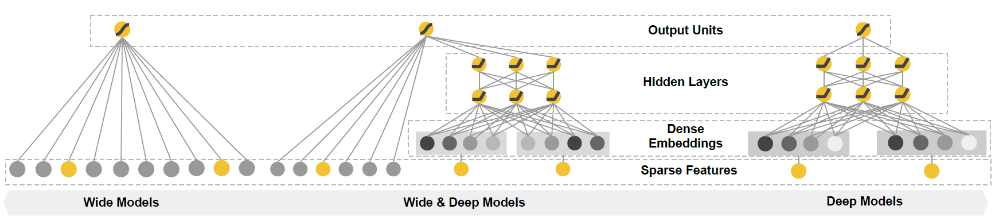

# Wide & Deep Learning for Recommender Systems

## 0.  本文信息

```
@inproceedings{cheng2016wide,
  title={Wide \& deep learning for recommender systems},
  author={Cheng, Heng-Tze and Koc, Levent and Harmsen, Jeremiah and Shaked, Tal and Chandra, Tushar and Aradhye, Hrishi and Anderson, Glen and Corrado, Greg and Chai, Wei and Ispir, Mustafa and others},
  booktitle={Proceedings of the 1st workshop on deep learning for recommender systems},
  pages={7--10},
  year={2016}
}
```


## 1. Contribution

- 提出的**Wide&Deep**框架能联合训练(jointly training)神经网络及经过特征变换的线性模型，适合大量稀疏输入的推荐系统。
- 在*Google Play*上测试效果好，代码开源。

见下图，很直接的NN+LR的尝试。




## 2. Motivation

推荐系统处理的问题：**搜索排序(search ranking)**。

要实现：

- memorization

  历史数据中挖掘关联性。

- generalization

  泛化出新的特征组合。

  